# postprocess/ dependency map and consolidation plan

Built by reading all 9 files under `postprocess/` directly (no static-analysis tool) on 2026-08-13.
Scope is `postprocess/*.py` only — the `scripts/*.sh` launchers aren't covered here. This is the
map and the plan; §1–§6 describe the codebase as it exists today, §7–§12 design and sequence the
consolidation.

Legend used throughout: **foundation module** = no internal imports, everything else builds on it.
**Consumer script** = has its own `main()`, run from the CLI. Findings/candidates are cross-referenced
by section number (e.g. "§7 finding 3").

## Table of contents

1. [Module graph](#1-module-graph)
2. [Cross-module function calls](#2-cross-module-function-calls)
3. [Internal pipelines](#3-internal-pipelines)
4. [Functional pipeline](#4-functional-pipeline)
5. [Full function reference](#5-full-function-reference)
6. [Duplication & consolidation candidates](#6-duplication--consolidation-candidates)
7. [Consolidation move-list](#7-consolidation-move-list)
8. [Target architecture](#8-target-architecture)
9. [Stage 3 engine design](#9-stage-3-engine-design)
10. [Report style guide](#10-report-style-guide)
11. [Test suite audit](#11-test-suite-audit)
12. [Implementation roadmap](#12-implementation-roadmap)

---

## 1. Module graph

*Who imports whom.*

Three files have zero internal imports and everything else is built on top of them.
`calltree_common.py` is pure tree/render/merge math with no opinion on filtering;
`extract_CPU_hotspots.py` and `extract_GPU_hotspots.py` own the two raw data formats (rocprof-sys
text tables, rocprofv3 CSV) and never import each other.

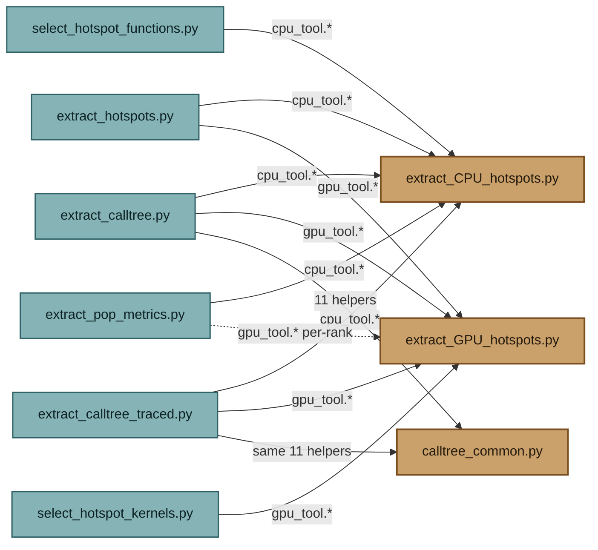

Every arrow is a real `import ... as` line. Dotted = conditional (only taken when a paired
rocprofv3 directory exists). No cycles anywhere — the three foundation modules never import a
consumer script or each other.

## 2. Cross-module function calls

*The actual surface area.*

The import graph above says "depends on the whole module." This is narrower: every function (or
shared constant) that at least one other file actually calls or reads. Anything from a foundation
module not shown here is private to that file.

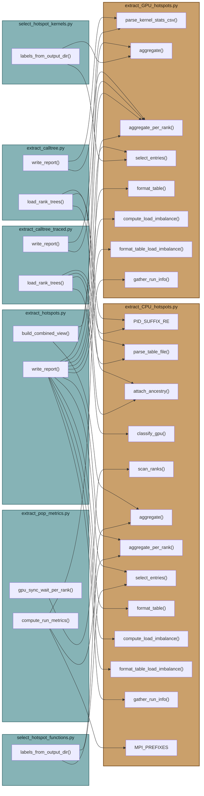

`extract_hotspots.py` touches nearly the entire public surface of both foundation modules — it's
the widest consumer by far. `extract_pop_metrics.py` is the only file that reaches past
`aggregate_per_rank()` into `scan_ranks()` directly, to see rows `aggregate_per_rank()` would
otherwise filter out (GPU-classified sync-wait calls).

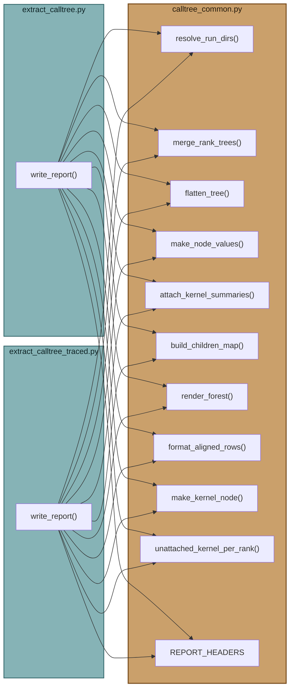

Both calltree tools call the exact same 11 things in `calltree_common.py`, in the same order,
inside a same-shaped `write_report()`. That symmetry is why the module exists — and it's also the
tell that the two callers themselves are close enough to be a single parameterized tool (see §6,
finding 7).

## 3. Internal pipelines

*The two files that are hardest to read top-to-bottom.*

Module- and function-level graphs above don't show *order*. These two files are the ones where a
linear read is misleading — a row gets mutated by three separate passes before it's safe to
aggregate. This is that order, made explicit.

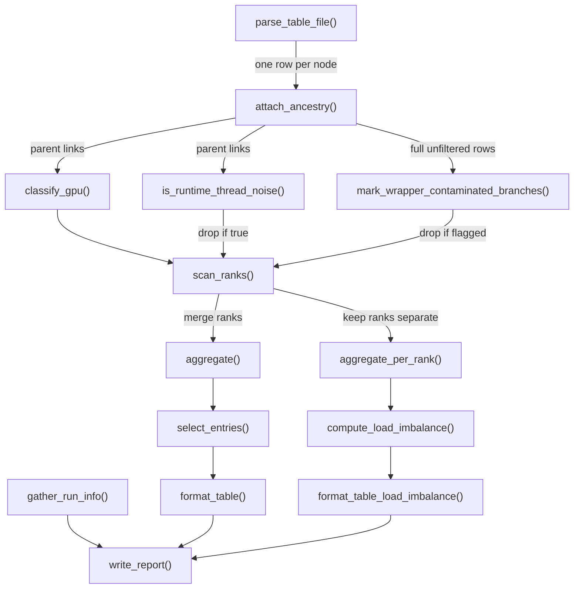

`extract_CPU_hotspots.py`, 928 lines. The three passes hanging off `attach_ancestry()` all read
the same parent-linked rows but mutate/flag them independently — order matters
(`mark_wrapper_contaminated_branches()` must see the full, unfiltered tree) but nothing in the
file signals that beyond a code comment.

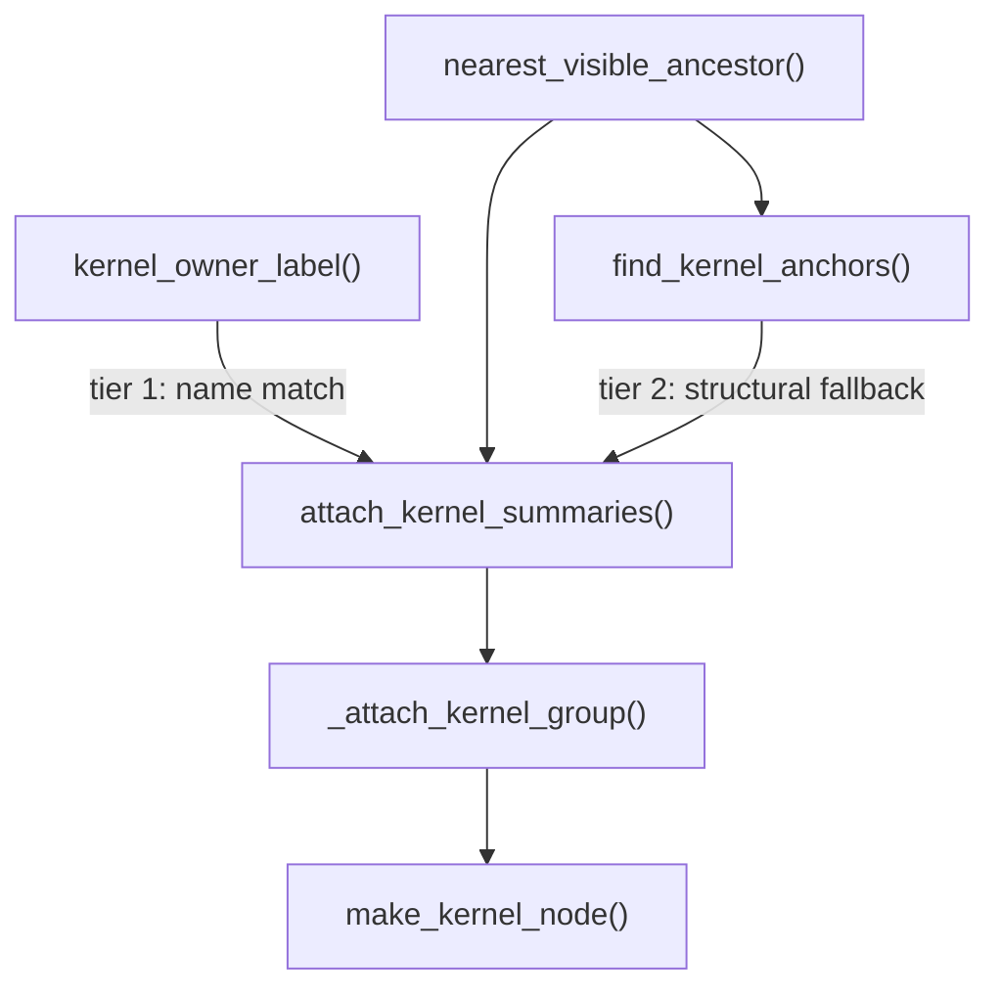

`calltree_common.py`'s GPU-kernel placement. Tier 1 (`kernel_owner_label()` name match) is tried
first for every kernel; only the leftovers fall to tier 2's structural guess via
`find_kernel_anchors()` — both tiers converge on the same `_attach_kernel_group()` to do the
actual per-rank weighting.

## 4. Functional pipeline

*The same six stages, four tools, file boundaries ignored.*

Regardless of which file a stage happens to live in today, all four hotspot/calltree tools run
the same shape of pipeline: **read profile → ancestry tree → filter noise → merge ranks / LB →
create tables → report**. What differs is which stages a tool actually needs, and — this is the
part the file view hides — *which mechanism* a shared stage name is implemented with. "Merge
ranks" means two structurally unrelated things below.

| stage | CPU hotspots | GPU hotspots | calltree | calltree traced |
|---|---|---|---|---|
| **1 · read profile** | `parse_table_file()` — text table → rows | `parse_kernel_stats_csv()` — kernel_stats.csv → rows | `cpu_tool.parse_table_file()` — prefers sampling_wall_clock-*, falls back to wall_clock-* | `cpu_tool.parse_table_file()` — prefers wall_clock-*, falls back to sampling_wall_clock-* |
| **2 · ancestry tree** | `attach_ancestry()` — built only to support stage 3, never rendered | *n/a* — a kernel dispatch is a leaf event; the CSV carries no call-stack/depth to reconstruct | `cpu_tool.attach_ancestry()` + `propagate_gpu_to_untethered_thread_roots()` — load-bearing, this IS the output | `cpu_tool.attach_ancestry()` — load-bearing, same role, no untethered-root pass needed |
| **3 · filter noise** | `classify_gpu()`, `is_runtime_thread_noise()`, `mark_wrapper_contaminated_branches()` — 3 tiers, all "drop or bucket" | *n/a* — every row is real device time; no runtime bookkeeping to filter out | `classify_gpu_broad()`, `is_compiler_runtime_noise()`, `is_mpi_territory()`, `prune_wrapper_contaminated_branches()` + `splice_out_wrapper_nodes()` — 4 tiers, 3 different treatments: drop / collapse / splice | `cpu_tool.classify_gpu()` + `is_kernel_descriptor_artifact()` — 1 tier only |
| **4 · merge ranks / LB** | `scan_ranks()` (merge by label, per rank), `aggregate()` / `aggregate_per_rank()`, `compute_load_imbalance()` | `aggregate()` / `aggregate_per_rank()` (sum by kernel name; 1 file = 1 rank), `compute_load_imbalance()` | `common.merge_rank_trees()` — merge by TREE POSITION, not label; `aggregate_node_stats()` — per-node LB | `common.merge_rank_trees()` — identical mechanism to calltree; `aggregate_node_stats()` |
| **5 · create tables** | `select_entries()` + `gather_run_info()` metadata | `select_entries()` + `gather_run_info()` metadata | `common.attach_kernel_summaries()` — nests GPU kernels into the CPU tree, the tree-shaped equivalent of a table | `common.attach_kernel_summaries()` — identical to calltree |
| **6 · report** | `format_table()` → `write_report()` → hotspots.txt | `format_table()` → `write_report()` → hotspots.txt | `render_forest()` → `write_report()` → calltree.txt | `render_forest()` → `write_report()` → calltree_traced.txt |

### The fork the file view doesn't show

**Stage 4 is two unrelated mechanisms wearing one name.** CPU/GPU hotspots merge *by label* — same
function name anywhere in the tree is one bucket, no structural memory. calltree/calltree_traced
merge *by tree position* via `merge_rank_trees()` — same label only merges if it sits at the same
place in every rank's tree. These aren't two implementations of the same idea; they're two
different definitions of "the same function across ranks." A consolidation that tried to unify
stage 4 into one merge function would be wrong to attempt — this is a real fork, not duplication.

**Stage 3 is where all the variance lives.** 0 tiers (GPU hotspots) → 1 tier (calltree traced) →
3 tiers (CPU hotspots) → 4 tiers with 3 different treatments (calltree). Stages 1, 2, 5, and 6 stay
nearly uniform in shape across every tool that has them at all — the noise-filtering stage is the
actual complexity of this codebase, not the parsing or reporting around it.

### Per-tool stage diagrams

**CPU hotspots** — three independent noise checks converge back into one merge step; none of them
talk to each other, they just each get a veto on whether a row survives to `scan_ranks()`.

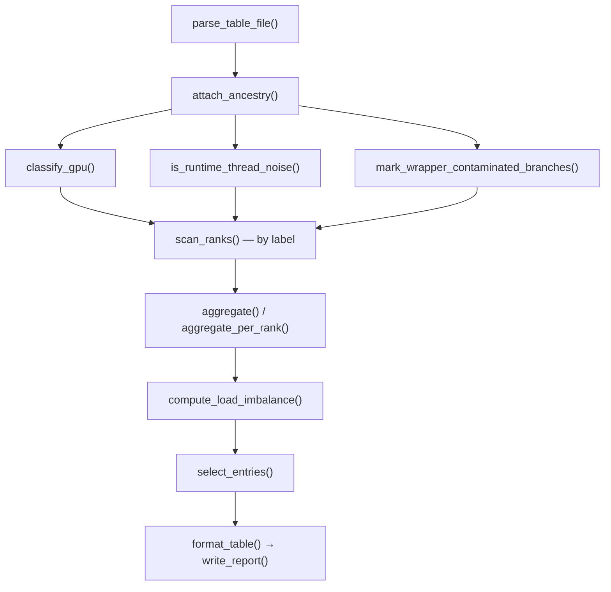

**GPU hotspots** — the shortest pipeline of the four; two whole stages skipped because a kernel
dispatch record has no tree to build and nothing ambiguous to filter.

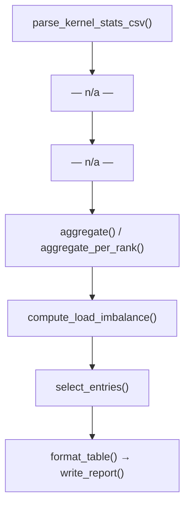

**calltree (sampling-based)** — the richest stage 3 of all four tools, and the only one where
noise is treated three different ways (prune / collapse / splice) instead of one.

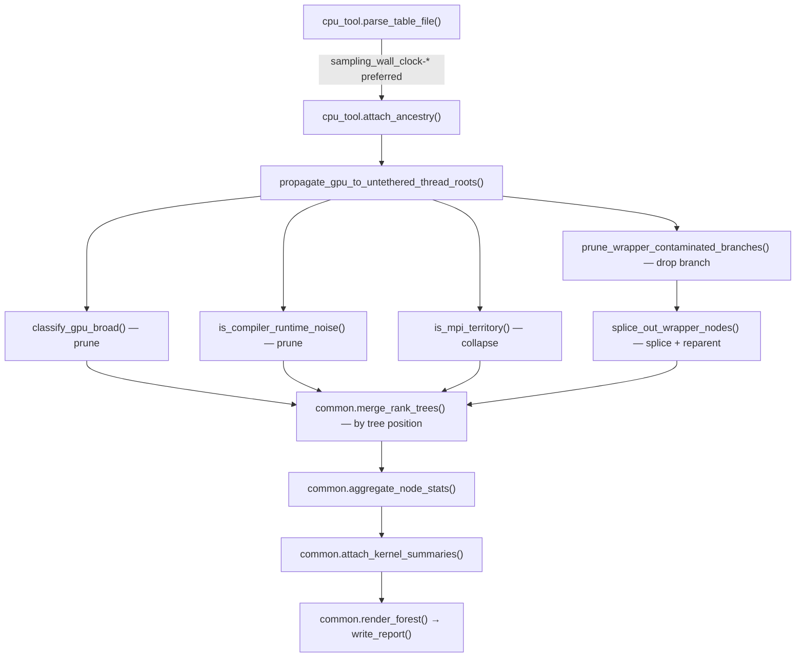

**calltree traced** — same skeleton as calltree above, stage 4/5/6 mechanisms identical; the
entire difference between these two tools lives in stage 1 (which file wins) and stage 3
(one tier vs. four).

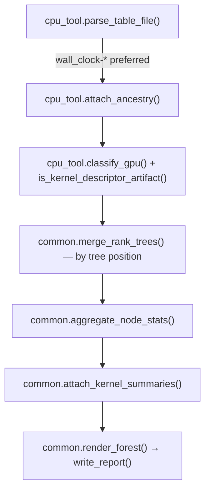

## 5. Full function reference

*Every function, one file at a time.* The ground truth behind the diagrams above, including
purely-internal helpers. "Calls" only lists what a function calls that's interesting
(cross-module, or another function in the same file); it skips stdlib calls.

### calltree_common.py — 17 functions · foundation · no imports

Shared tree math for both calltree tools: cross-rank merge, kernel-anchor placement, tree
rendering. Has no opinion on which nodes get filtered — each caller supplies its own
`is_pruned()`/`collapses_children()`.

| function | purpose | calls |
|---|---|---|
| `resolve_run_dirs(run_dir)` | Split a run dir into (cpu_dir, gpu_dir) via the rocprof-sys/ and rocprofv3/ subdir convention. | — |
| `is_kernel_launch(label)` | Substring match against `KERNEL_LAUNCH_LABEL_SUBSTRINGS`. | — |
| `make_kernel_node(label, per_rank)` | Build a synthetic tree node with the same per_rank shape as a real merged node. | — |
| `get_children(node, children_map)` | A node's real + synthetic (static_children) kids together. | — |
| `nearest_visible_ancestor(row, is_pruned)` | Walk parent links past pruned nodes to find where a kernel would actually attach. | — |
| `merge_rank_trees(ranks)` | Structurally merge N per-rank trees into one, matching by label at each level. | — |
| `flatten_tree(roots)` | Pre-order flat list of a merged tree, parent links intact. | — |
| `aggregate_node_stats(per_rank, rank_keys)` | avg/std_dev/min/max for one node across every rank (missing = 0, not omitted). | — |
| `make_node_values(rank_keys)` | Closure factory returning a node → column-tuple function bound to rank_keys. | `aggregate_node_stats()` |
| `find_kernel_anchors(rows, is_pruned)` | Coarse fallback: nearest visible launch-call ancestor per kernel-launch row. | `is_kernel_launch()`, `nearest_visible_ancestor()` |
| `kernel_owner_label(kernel_name)` | Strip Cray's `$ck_...` kernel-naming suffix to recover the owning subroutine. | — |
| `_attach_kernel_group(anchor_weights, kernel_names, gpu_kernel_by_rank)` | Attach a synthetic kernel-summary node at 1+ anchors, proportionally split by weight, per rank. | `make_kernel_node()` |
| `attach_kernel_summaries(rows, gpu_kernel_by_rank, is_pruned)` | Two-tier placement: name-match via `kernel_owner_label()` first, structural fallback second. | `kernel_owner_label()`, `nearest_visible_ancestor()`, `_attach_kernel_group()`, `find_kernel_anchors()` |
| `unattached_kernel_per_rank(kernel_names, gpu_kernel_by_rank)` | Per-rank breakdown for kernels attach_kernel_summaries() couldn't place anywhere. | — |
| `count_all_descendants(nodes, children_map, is_pruned)` | Recursive count, for the "N more nodes hidden" marker line. | `get_children()` (recursive) |
| `render_node(...)` | Recursive tree-drawing (├──/└──) into a flat (label, values) list. | `get_children()`, `count_all_descendants()`, caller's `node_values()` (recursive) |
| `render_forest(roots, children_map, max_depth, is_pruned, node_values)` | render_node() over every root. | `render_node()` |
| `build_children_map(rows, collapses_children)` | {id(parent): [children]}, skipping children of a collapsed parent. | — |
| `format_aligned_rows(rows, headers)` | Right-align a (label, values) list into fixed-width text columns. | — |

### extract_CPU_hotspots.py — 28 functions · foundation · no imports · 928 lines

Owns the rocprof-sys pipe-delimited text-table format end to end: parsing, ancestry
reconstruction, every noise classification tier, rank-aware aggregation, and the CPU hotspots
report itself.

| function | purpose | calls |
|---|---|---|
| `parse_table_file(path)` | Parse one timemory text table into row dicts, or None if the header doesn't match. | `clean_label()`, `thread_id_from_raw_label()` |
| `thread_id_from_raw_label(raw_label)` | Pull the OS-thread index out of the raw LABEL prefix. | — |
| `clean_label(raw_label)` | Strip the rank/thread prefix and `\|_` indentation from a raw label. | — |
| `is_gpu_entry(label, filename)` | GPU_API_PREFIXES startswith, or GPU_COMPILE_NOISE_SUBSTRINGS substring, or a GPU_FILE_HINTS filename hint. | — |
| `is_rocprofsys_wrapper_noise(label)` | Substring match against ROCPROFSYS_WRAPPER_SUBSTRINGS. | — |
| `attach_ancestry(rows)` | Reconstruct parent links from DEPTH via a depth-stack walk; marks is_thread_root. | — |
| `classify_gpu(row, path)` | is_gpu_entry() on the row, or inherited from a GPU ancestor if this is a thread root. | `is_gpu_entry()` (recursive walk up parents) |
| `is_mpi_territory(label)` | MPI_PREFIXES startswith or MPI_FORTRAN_SHIM_SUFFIXES endswith. | — |
| `is_runtime_thread_noise(row)` | Thread-root row with an MPI-territory ancestor (Cray MPICH progress threads). | `is_mpi_territory()` (walk up parents) |
| `mark_wrapper_contaminated_branches(rows)` | Structural counterpart to is_rocprofsys_wrapper_noise(): flags a whole sibling subtree as noise when it has a matching descendant AND a genuinely clean sibling exists. | `is_rocprofsys_wrapper_noise()` |
| `scan_ranks(output_dir)` | Group files by rank, drop noise rows, merge same-label rows per rank. | `parse_table_file()`, `attach_ancestry()`, `mark_wrapper_contaminated_branches()`, `is_rocprofsys_wrapper_noise()`, `is_runtime_thread_noise()`, `classify_gpu()` |
| `aggregate(output_dir)` | scan_ranks() then merge every rank into one CPU/GPU total. | `scan_ranks()` |
| `aggregate_per_rank(output_dir, unfiltered=False)` | Like aggregate(), but keeps each rank's totals separate (CPU rows only). | `scan_ranks()` |
| `compute_load_imbalance(per_file_totals, ...)` | Per-label avg/std_dev/min/max across ranks, ranked by std_dev. | — |
| `format_table_load_imbalance(entries)` | Text-render the load-imbalance table. | — |
| `select_entries(entries, total_runtime, ..., rank_by="self")` | top/threshold/all selection, sorted by self or inclusive time. | — |
| `format_table(entries)` | Text-render the main hotspots table. | — |
| `find_extra_artifacts(output_dir)` | Glob for .proto / .db files to mention (not parsed). | — |
| `load_metadata(output_dir)` | Best-effort read of metadata.json. | — |
| `find_first_key(d, candidate_keys)` | Case-insensitive key search, one level of nesting deep. | recursive (depth-limited) |
| `guess_executable / guess_run_datetime / guess_total_runtime / guess_num_ranks` | Metadata-guessing family, each with its own candidate-key list and fallback. | `find_first_key()` |
| `gather_run_info(output_dir, scanned_files)` | Bundle the four guesses above into one dict. | `load_metadata()`, the four `guess_*()` |
| `write_report(output_dir, dest_path, ...)` | Assemble and write hotspots.txt. | `aggregate()`, `find_extra_artifacts()`, `gather_run_info()`, `select_entries()`, `format_table()`, `aggregate_per_rank()`, `compute_load_imbalance()`, `format_table_load_imbalance()` |
| `main(argv)` | argparse + dispatch. | `write_report()` |

### extract_GPU_hotspots.py — 16 functions · foundation · no imports

Owns rocprofv3's kernel_stats.csv format. Structurally a near-mirror of
extract_CPU_hotspots.py's aggregation half (by declared convention — see §6 finding 8 and §7)
with none of the tree/ancestry/classification machinery, since a kernel_stats.csv row has no call
tree at all.

| function | purpose | calls |
|---|---|---|
| `parse_kernel_stats_csv(path)` | Parse one kernel_stats.csv, or None if required columns are missing. | — |
| `aggregate(output_dir)` | Sum every kernel_stats.csv found by kernel name. | `parse_kernel_stats_csv()` |
| `aggregate_per_rank(output_dir)` | One file = one rank's per-kernel totals, kept separate. | `parse_kernel_stats_csv()` |
| `compute_load_imbalance(per_file_totals, ...)` | Same shape as the CPU-side function of the same name — duplicated on purpose. | — |
| `format_table_load_imbalance(entries)` | Text-render, kernel-flavored header. | — |
| `select_entries(entries, total_ns, ...)` | top/threshold/all, always by total device time (kernels have no self/inclusive split). | — |
| `format_table(entries)` | Text-render the kernel hotspots table. | — |
| `load_config_json(output_dir)` | Best-effort read of rocprofv3's optional `<pid>_config.json`. | — |
| `find_first_key(d, candidate_keys)` | Byte-for-byte duplicate of extract_CPU_hotspots.py's function of the same name. | recursive |
| `guess_executable / guess_run_datetime / guess_total_runtime / guess_num_ranks` | Same guessing family, against config.json's (different, undocumented) key names. | `find_first_key()` |
| `gather_run_info(output_dir, scanned_files)` | Bundle the four guesses. | `load_config_json()`, the four `guess_*()` |
| `write_report(output_dir, dest_path, ...)` | Assemble and write the GPU hotspots report. | `aggregate()`, `gather_run_info()`, `select_entries()`, `format_table()`, `aggregate_per_rank()`, `compute_load_imbalance()`, `format_table_load_imbalance()` |
| `main(argv)` | argparse + dispatch. | `write_report()` |

### extract_calltree.py — 15 functions · consumer · sampling-based tree

Renders an indented call tree from sampling_wall_clock-*.txt (true call depth, statistically
approximate timing). Owns four independent noise tiers of its own on top of what cpu_tool provides.

| function | purpose | calls |
|---|---|---|
| `is_kernel_descriptor_artifact(label)` | Labels ending in .kd — duplicate of extract_calltree_traced.py's function of the same name. | — |
| `is_gpu_api_entry(label)` | Substring match against this file's own (broadened) GPU_NOISE_SUBSTRINGS. | — |
| `is_rocprofsys_wrapper(label)` | Substring match against the shared ROCPROFSYS_WRAPPER_SUBSTRINGS — same check as cpu_tool's is_rocprofsys_wrapper_noise(), different name. | — |
| `is_mpi_territory(label)` | Byte-for-byte duplicate of cpu_tool.is_mpi_territory(). | — |
| `is_compiler_runtime_noise(label)` | Substring match against COMPILER_RUNTIME_SUBSTRINGS (this tool's own 4th tier, no cpu_tool equivalent). | — |
| `prune_wrapper_contaminated_branches(rows)` | Same structural algorithm as cpu_tool.mark_wrapper_contaminated_branches(), but filters/returns instead of flagging in place. | `is_rocprofsys_wrapper()` |
| `classify_gpu_broad(row)` | Same ancestry-propagation idea as cpu_tool.classify_gpu(), against this file's broader substring checks. | `is_gpu_api_entry()`, `is_kernel_descriptor_artifact()` |
| `propagate_gpu_to_untethered_thread_roots(rows)` | Second GPU-ancestry pass, for threads that sample as their own untethered root (DEPTH resets to 0, parent=None). | `is_rocprofsys_wrapper()` |
| `splice_out_wrapper_nodes(rows)` | Remove wrapper rows, reparenting children up past them. | `is_rocprofsys_wrapper()` |
| `load_rank_trees(cpu_dir, show_rocprofsys_internals)` | Per rank: parse, classify (4 tiers), prune, splice. | cpu_tool.`PID_SUFFIX_RE`, cpu_tool.`parse_table_file()`, cpu_tool.`attach_ancestry()`, `classify_gpu_broad()`, `is_compiler_runtime_noise()`, `is_mpi_territory()`, `propagate_gpu_to_untethered_thread_roots()`, `prune_wrapper_contaminated_branches()`, `splice_out_wrapper_nodes()` |
| `write_report(run_dir, dest_path, ...)` | Assemble and write calltree.txt. | common.`resolve_run_dirs()`, `load_rank_trees()`, common.`merge_rank_trees()`, common.`flatten_tree()`, gpu_tool.`aggregate_per_rank()`, `_kernel_totals_with_counts()`, common.`make_node_values()`, common.`attach_kernel_summaries()`, common.`build_children_map()`, common.`render_forest()`, common.`format_aligned_rows()` |
| `_kernel_totals_with_counts(gpu_dir, rank_index)` | Re-parse kernel_stats.csv directly for call counts gpu_tool.aggregate_per_rank() doesn't return. | gpu_tool.`parse_kernel_stats_csv()` |
| `main(argv)` | argparse (5 --show-* flags) + dispatch. | `write_report()` |

### extract_calltree_traced.py — 6 functions · consumer · wall_clock-based tree

The fast, exact-where-instrumented sibling of extract_calltree.py — one filter tier (GPU-API
noise, via cpu_tool.classify_gpu() directly) instead of four.

| function | purpose | calls |
|---|---|---|
| `load_rank_trees(cpu_dir)` | Per rank: parse + ancestry + classify, no pruning/splicing at all. | cpu_tool.`PID_SUFFIX_RE`, cpu_tool.`parse_table_file()`, cpu_tool.`attach_ancestry()`, cpu_tool.`classify_gpu()`, `is_kernel_descriptor_artifact()` |
| `is_kernel_descriptor_artifact(label)` | Duplicate of extract_calltree.py's function of the same name. | — |
| `make_is_pruned(show_gpu_api)` | Closure factory — this tool's only filter tier. | — |
| `write_report(run_dir, dest_path, ...)` | Assemble and write calltree_traced.txt. | common.`resolve_run_dirs()`, `load_rank_trees()`, `make_is_pruned()`, common.`make_node_values()`, common.`merge_rank_trees()`, common.`flatten_tree()`, gpu_tool.`aggregate_per_rank()`, `_kernel_totals_with_counts()`, common.`attach_kernel_summaries()`, common.`build_children_map()`, common.`render_forest()`, common.`format_aligned_rows()` |
| `_kernel_totals_with_counts(gpu_dir, rank_index)` | Duplicate of extract_calltree.py's function of the same name. | gpu_tool.`parse_kernel_stats_csv()` |
| `main(argv)` | argparse (1 --show-gpu-api flag) + dispatch. | `write_report()` |

### extract_hotspots.py — 4 functions · consumer · widest foundation reach

Fuses a rocprof-sys run and a rocprofv3 run into one ranking, correcting for the GPU-sync-wait
double-count between them.

| function | purpose | calls |
|---|---|---|
| `build_combined_view(rocprof_sys_dir, rocprofv3_dir)` | Subtract sync-wait time from the CPU total, add real GPU kernel time, build the fused entry list. | cpu_tool.`aggregate()`, gpu_tool.`aggregate()` |
| `format_table_fused(entries)` | Text-render the fused table (adds a domain column). | — |
| `write_report(rocprof_sys_dir, rocprofv3_dir, dest_path, ...)` | Assemble all 6 tables into hotspots.txt. | `build_combined_view()`, cpu_tool.`gather_run_info()`, gpu_tool.`gather_run_info()`, cpu_tool.`select_entries()` ×2, gpu_tool.`select_entries()`, `format_table_fused()`, cpu_tool.`format_table()` ×2, gpu_tool.`format_table()`, cpu_tool.`aggregate_per_rank()`, cpu_tool.`compute_load_imbalance()`, cpu_tool.`format_table_load_imbalance()`, gpu_tool.`aggregate_per_rank()`, gpu_tool.`compute_load_imbalance()`, gpu_tool.`format_table_load_imbalance()` |
| `main(argv)` | argparse (2 positional dirs) + dispatch. | `write_report()` |

### extract_pop_metrics.py — 9 functions · consumer · only file with a private resolve_run_dirs

POP-inspired Load Balance / Communication Efficiency / Parallel Efficiency from one run;
Computation/Global Efficiency across a scaling study.

| function | purpose | calls |
|---|---|---|
| `resolve_run_dirs(run_dir)` | Byte-for-byte duplicate of calltree_common.resolve_run_dirs() — not imported. | — |
| `gpu_sync_wait_per_rank(cpu_dir)` | Per-rank sync-wait self-time; goes straight to scan_ranks() since aggregate_per_rank() would drop these GPU-classified rows. | cpu_tool.`scan_ranks()` |
| `compute_run_metrics(run_dir)` | Per-rank total/comm/useful-compute time, then LB/CommE/PE for the run. | `resolve_run_dirs()`, cpu_tool.`aggregate_per_rank()` ×2 (self + inclusive), gpu_tool.`aggregate_per_rank()`, `gpu_sync_wait_per_rank()` |
| `compute_scaling_metrics(ref_metrics, run_metrics, scaling)` | Computation Efficiency + Global Efficiency vs. a reference run. | — |
| `compute_gpu_efficiency(ref_metrics, run_metrics, scaling)` | Same strong/weak ratio shape, over GPU-only busy time. | — |
| `run_label(run_dir) / fmt(value, digits)` | Small text-formatting helpers. | — |
| `write_report(run_dirs, dest_path, scaling)` | Assemble and write pop_metrics.txt across 1+ runs. | `compute_run_metrics()` (per dir), `compute_gpu_efficiency()`, `run_label()`, `fmt()`, `compute_scaling_metrics()` |
| `main(argv)` | argparse (reference + scaled dirs + --scaling) + dispatch. | `write_report()` |

### select_hotspot_functions.py — 7 functions · consumer · rocprof-sys-instrument bridge

Two unrelated jobs sharing a file: resolve hotspot function names into a -R regex list, and
(separately) check post-hoc whether rocprof-sys-instrument actually instrumented them.

| function | purpose | calls |
|---|---|---|
| `escape_for_instrument_regex(name)` | Escape std::regex ECMAScript metacharacters only. | — |
| `labels_from_output_dir(rocprof_sys_dir, ...)` | Read hotspot labels straight from a rocprof-sys output dir. | cpu_tool.`aggregate()`, cpu_tool.`select_entries()` |
| `labels_from_report(report_path)` | Parse the "CPU compute hotspots" table out of an already-written report. | — |
| `_iter_instrumented_entries(data)` | Best-effort iteration over instrumented.json's unconfirmed top-level shape. | — |
| `find_lost_functions(instrumented_json_path, requested_labels)` | Which requested labels never show up in instrumented.json. | `_iter_instrumented_entries()` |
| `main(argv)` | argparse, dispatches to resolve mode or --check-instrumented mode. | `labels_from_output_dir()`, `labels_from_report()`, `find_lost_functions()`, `escape_for_instrument_regex()` |

### select_hotspot_kernels.py — 3 functions · consumer · rocprof-compute bridge

Simpler CPU-side counterpart: rocprof-compute's -k filter takes plain substrings, so there's no
regex-escaping or instrumented-check half at all.

| function | purpose | calls |
|---|---|---|
| `labels_from_output_dir(rocprofv3_dir, ...)` | Read hotspot kernel names straight from a rocprofv3 output dir, dropping single-dispatch kernels by default. | gpu_tool.`aggregate()`, gpu_tool.`select_entries()` |
| `labels_from_report(report_path, require_multiple_calls)` | Parse the "GPU kernel hotspots" table out of an already-written report. | — |
| `main(argv)` | argparse + dispatch. | `labels_from_output_dir()`, `labels_from_report()` |

## 6. Duplication & consolidation candidates

*What the graph exposes.* Ranked roughly by how much drift risk each one carries — not by line count.

**1. `resolve_run_dirs()` exists twice, one copy silently unreachable from the other** — *exact duplicate*
`calltree_common.py:62-71` vs. `extract_pop_metrics.py:58-72`. Identical logic (cpu_subdir/gpu_subdir
convention, same fallback), but `extract_pop_metrics.py` never imports `calltree_common` — it
re-derived the exact same function independently. A future change to the run-dir convention has to
be remembered in two places, and this is the one pair in the whole codebase where the duplication
looks accidental rather than declared.

**2. Two structural branch-pruning algorithms, same shape, opposite calling convention** — *near-duplicate*
`extract_CPU_hotspots.py:310-400` `mark_wrapper_contaminated_branches()` vs.
`extract_calltree.py:186-270` `prune_wrapper_contaminated_branches()`. Both walk the same
parent-linked rows, memoize the same `subtree_has_match()` recursion, and apply the identical
"needs a clean sibling" safety rule — but one mutates rows in place with a flag, the other filters
and returns a new list. The docstrings cross-reference each other explicitly, a sign this is one
algorithm being kept in sync by hand across two files.

**3. Two names for the same wrapper-noise predicate** — *naming drift*
`extract_CPU_hotspots.py:223-225` `is_rocprofsys_wrapper_noise()` vs.
`extract_calltree.py:171-173` `is_rocprofsys_wrapper()`. Both check the same shared
`ROCPROFSYS_WRAPPER_SUBSTRINGS` constant, same body. The constant is properly shared
(`extract_calltree.py` does `= cpu_tool.ROCPROFSYS_WRAPPER_SUBSTRINGS`) but the function that uses
it was rewritten under a different name instead of imported.

**4. `is_mpi_territory()` is a byte-for-byte duplicate** — *exact duplicate*
`extract_CPU_hotspots.py:277-279` vs. `extract_calltree.py:176-178`. Same two-line body, same
constants (already shared as `MPI_PREFIXES`/`MPI_FORTRAN_SHIM_SUFFIXES`). Smallest finding here
but also the cheapest fix — a one-line import instead of a four-line redefinition.

**5. `is_kernel_descriptor_artifact()` and `_kernel_totals_with_counts()` are duplicated between the two calltree tools** — *exact duplicate*
`extract_calltree.py:157-163, 541-553` vs. `extract_calltree_traced.py:136-148, 261-274`. Both
functions are identical in the two files (the second one's docstring in `extract_calltree.py` even
says "see extract_calltree_traced.py's identical function"). Since neither tool imports from the
other, this pair would be a natural third or fourth entry in `calltree_common.py` alongside the
11 functions already shared there.

**6. `SYNC_WAIT_LABELS` defined twice** — *declared duplicate*
`extract_hotspots.py:27` vs. `extract_pop_metrics.py:37`. Same two-string set
(`hipStreamSynchronize`, `hipDeviceSynchronize`), same rationale in both docstrings, deliberately
not imported per this codebase's stated "small constants are duplicated across standalone tools"
convention. Low risk on its own, but see finding 8 — this convention is exactly how the
MPI_PREFIXES case-sensitivity bug happened before.

**7. `extract_calltree.py` and `extract_calltree_traced.py` are ~70% the same file** — *structural duplicate*
`extract_calltree.py` (593 lines) vs. `extract_calltree_traced.py` (298 lines). Per §2's second
diagram, both call the identical 11 `calltree_common` functions in the identical order inside a
same-shaped `write_report()` — the same GPU-kernel-nesting block, the same rank-key handling, the
same caveats-footer pattern. The genuine difference is small: which files `load_rank_trees()`
prefers (sampling vs. wall_clock) and how many noise tiers get applied before the tree is handed
off. That difference could plausibly become a parameter of one tool rather than the reason for two.

**8. `extract_GPU_hotspots.py` duplicates four of `extract_CPU_hotspots.py`'s generic helpers** — *declared duplicate*
`extract_CPU_hotspots.py` vs. `extract_GPU_hotspots.py`: `compute_load_imbalance()` (exact),
`format_table_load_imbalance()` (exact but for one header word), `find_first_key()` (exact),
`select_entries()` (near-exact — see §7). All four are declared-intentional duplicates ("each
extractor is meant to stand alone" — `extract_GPU_hotspots.py:196`). Corrected from an original
count of 5: `format_table()` looked identical at a glance but renders genuinely different columns
per domain (self/inclusive time has no meaning for a kernel dispatch) — it's a parallel
implementation, not a duplicate, and shouldn't be merged. This is the same pattern that already
caused a real bug: `extract_pop_metrics.py`'s independently-maintained `MPI_PREFIXES` silently
diverged from `extract_calltree.py`'s (case sensitivity, missing `mpidi_`) before this session's
cleanup reconciled them — see `docs/DEVELOPMENT_HISTORY.md`. Every real duplicate pair here is a
candidate for the same kind of silent drift. Full move-by-move breakdown in §7.

## 7. Consolidation move-list

*Every `cpu_tool.*`/`gpu_tool.*` function, sorted by what to do with it.* §6 found duplication by
tracing the graph. This goes further: every function that currently crosses a file boundary,
checked line-by-line and sorted into what actually needs to happen to it — not just "duplicate or
not." Nothing here has been changed yet; this is the plan before the first edit.

### Category: relocate — pure relocation, no logic decision needed

Single source of truth today, already called cross-file exactly as-is — just filed under one
tool's name instead of a shared one.

| stage | function(s) | current home | used by |
|---|---|---|---|
| 1 | `parse_table_file()`, `clean_label()`, `thread_id_from_raw_label()`, `PID_SUFFIX_RE` | extract_CPU_hotspots.py:122,143,193,202 | calltree, calltree_traced |
| 1 | `parse_kernel_stats_csv()` | extract_GPU_hotspots.py:57 | calltree, calltree_traced |
| 2 | `attach_ancestry()` | extract_CPU_hotspots.py:228 | calltree, calltree_traced |
| 3 | `classify_gpu()`, `is_gpu_entry()`, `GPU_API_PREFIXES`/`GPU_COMPILE_NOISE_SUBSTRINGS`/`GPU_FILE_HINTS` | extract_CPU_hotspots.py:30,213,253 | calltree_traced |
| 4 | `scan_ranks()`, `aggregate()`, `aggregate_per_rank()` (CPU) | extract_CPU_hotspots.py:403,513,573 | extract_hotspots, extract_pop_metrics, select_hotspot_functions |
| 4 | `aggregate()`, `aggregate_per_rank()` (GPU) | extract_GPU_hotspots.py:77,116 | extract_hotspots, extract_pop_metrics, select_hotspot_kernels, calltree, calltree_traced |

### Category: reference fix — true duplicate, one import replaces a copy

Same body in two files. No behavior change on merge, just delete a copy and point it at the original.

| function | copy 1 | copy 2 | fix |
|---|---|---|---|
| `resolve_run_dirs()` | calltree_common.py:62 | extract_pop_metrics.py:58 | delete pop_metrics' copy, import from calltree_common |
| `is_mpi_territory()` | extract_CPU_hotspots.py:277 | extract_calltree.py:176 | delete calltree's copy, call cpu_tool.is_mpi_territory() |
| `is_rocprofsys_wrapper_noise()` / `is_rocprofsys_wrapper()` | extract_CPU_hotspots.py:223 | extract_calltree.py:171 | same body, two names — keep one, import it |
| `compute_load_imbalance()` | extract_CPU_hotspots.py:604 | extract_GPU_hotspots.py:146 | byte-for-byte identical |
| `format_table_load_imbalance()` | extract_CPU_hotspots.py:647 | extract_GPU_hotspots.py:184 | identical except trailing header word ("function" vs "kernel") |
| `find_first_key()` | extract_CPU_hotspots.py:725 | extract_GPU_hotspots.py:242 | byte-for-byte identical |
| `is_kernel_descriptor_artifact()`, `_kernel_totals_with_counts()` | extract_calltree.py:157,541 | extract_calltree_traced.py:136,261 | §6 finding 5 — move both into calltree_common.py |

### Category: small decision — near-duplicate, narrow real differences, but a clean merge

Not a straight import — each has one genuine point of divergence to resolve first, but none of
them are a redesign.

- **`select_entries()`** (CPU `extract_CPU_hotspots.py:657` vs GPU `extract_GPU_hotspots.py:194`) —
  show_all/threshold/top logic and message strings are identical. CPU recomputes pct_total via a
  selectable key_field ("self" vs "inclusive"); GPU trusts pct_total already set by its own
  aggregate(). A shared version with GPU passing `key_field="sum"` covers both.
- **`mark_wrapper_contaminated_branches()` / `prune_wrapper_contaminated_branches()`**
  (`extract_CPU_hotspots.py:310` / `extract_calltree.py:186`) — identical algorithm. CPU hotspots
  flags rows in place; calltree filters and returns a new list. A shared
  `find_contaminated_row_ids(rows)` core, with a 3-line flag/filter wrapper on each side, keeps
  both call shapes.
- **`gather_run_info()` family** (`guess_executable()`/`guess_run_datetime()`/`guess_total_runtime()`/`guess_num_ranks()`,
  CPU `extract_CPU_hotspots.py:743-797` vs GPU `extract_GPU_hotspots.py:258-299`) — bigger than §6
  suggested; most bodies are structurally identical (`find_first_key(source, KEYS)` + the same
  list-unwrap/strip logic), differing only in which dict and which candidate-key tuple is passed.
  One implementation parameterized on `(source_dict, candidate_keys)` absorbs all eight functions.

### Category: stays put — not a duplicate, correctly separate

Considered and deliberately excluded, so they don't get merged by accident later.

| function | location | why it stays separate |
|---|---|---|
| `format_table()` | CPU:690 / GPU:213 | Correction from §6 finding 8 — renders genuinely different columns; looked like a duplicate, isn't one. |
| `is_runtime_thread_noise()` | extract_CPU_hotspots.py:282 | One owner, no counterpart — calltree's MPI treatment is "collapse," a different pipeline decision. |
| `is_compiler_runtime_noise()` | extract_calltree.py:181 | No CPU-hotspots equivalent tier exists at all — possibly a real coverage gap, not something to consolidate away. |
| `classify_gpu_broad()`, `propagate_gpu_to_untethered_thread_roots()`, `splice_out_wrapper_nodes()` | extract_calltree.py:273,295,346 | Each is calltree-tree-specific with nothing analogous on the flat-list hotspots side. |

### Category: already correct — model to replicate, not touch

All 11 `calltree_common.py` functions (§2's second diagram); constants `MPI_PREFIXES` /
`MPI_FORTRAN_SHIM_SUFFIXES` / `ROCPROFSYS_WRAPPER_SUBSTRINGS` / `GPU_API_PREFIXES` (always
referenced as `cpu_tool.X`, never re-typed).

## 8. Target architecture

> **Divergence (plan 2.4):** `resolve_run_dirs()` did not end up in `tree_render.py` as this
> section originally decided. Checking its actual call sites during plan 2.4 found it serves three
> tools, not two (`extract_pop_metrics.py` had its own independent duplicate — §6 finding 1), and
> it has zero coupling to rendering, trees, or merging. It landed in its own single-function
> module, `stage1_run_dirs.py`, instead — see
> [docs/plans/2.4-split-calltree-common.md](2.4-split-calltree-common.md). The table row below is
> left as originally written for the historical record; treat `stage1_run_dirs.py` as the actual
> final home.

> **Divergence (plan 2.7):** Stage 4's flat-and-tree split, and `rank_merge_math.py`, landed
> exactly as below except for one rename — `rank_merge_math.py` became `stage4_rank_merge_math.py`,
> matching the `stage1_`/`stage2_`/`stage3_`/`stage4_` prefix every other stage module already
> carries. Stage 5 landed differently than the "four files" table below: rather than
> `cpu_hotspots_table.py`/`gpu_hotspots_table.py` each carrying their own hand-written
> select/render pair, ranking-and-rendering itself turned out to be fully generic (the same
> mechanism ranks hotspots-by-%total and load-imbalance-by-coefficient-of-variation alike) and
> moved into one domain-agnostic backend, `stage5_table_render.py` (`select_entries()`/
> `render_table()`). Every table module downstream of it — `stage5_cpu_hotspots_table.py`,
> `stage5_gpu_hotspots_table.py`, `stage5_fused_hotspots_table.py`, `stage5_pop_metrics_table.py`,
> and a new `stage5_load_imbalance_table.py` (load-imbalance turned out to be one shared table used
> by both CPU and GPU tools, not a per-domain variant folded into each domain's own file) — is now
> just a column-spec plus whatever domain-specific computation feeds it, not a formatting
> function. Stage 6's `tree_render.py` also moved, not stayed: renamed `stage5_tree_render.py` and
> promoted out of stage 6 entirely (rendering a tree into report text is the same stage-5 job as
> rendering a table into report text), and it picked up the rank-loading and GPU-kernel-pairing
> logic that used to be duplicated between the two calltree tools, which now each get their own
> thin stage-5 companion module (`stage5_calltree_view.py`, `stage5_calltree_traced_view.py`) built
> on top of it — the calltree tools' equivalent of the hotspots tools' stage-5 table modules. See
> [docs/plans/2.7-stage4-flat-and-stage5-tables.md](2.7-stage4-flat-and-stage5-tables.md) for the
> full as-built layout and reasoning; the diagram and tables below are left as originally written
> for the historical record.

> **Divergence (plan 2.8):** §12's step-7 sketch names `report_builder.py`/`run_metadata.py`; both
> landed with the `stage6_` prefix instead (`stage6_report_builder.py`/`stage6_run_metadata.py`),
> matching the `stage1_`-`stage5_` convention every other internal shared module already carries —
> the tool files themselves (`extract_*.py`) stay unprefixed, since that prefix marks an internal
> shared module, not the user-facing CLI surface. `report_builder.py` also landed as a genuinely
> generic `render_report(header, sections, footer)` backend, not a thin `write_report_file()`/
> `section()` pair, and both calltree tools were wired into it in this same step (not deferred to
> §10's formatting pass as originally sketched), once `stage5_tree_render.py`'s two render
> functions stopped self-appending their own trailing blank line. See
> [docs/plans/2.8-stage6-composition.md](2.8-stage6-composition.md) for the full as-built design,
> including the one narrow, accepted blank-line exception to byte-identical output.

*Where §7's move-list actually lands.* Settled across a working session, stage by stage, up to
stage 6. Stage 3's *location* is decided; its internal shape gets its own dedicated pass (§9) —
treat `stage3_rocprofsys.py` below as a named placeholder there, not a finished design.

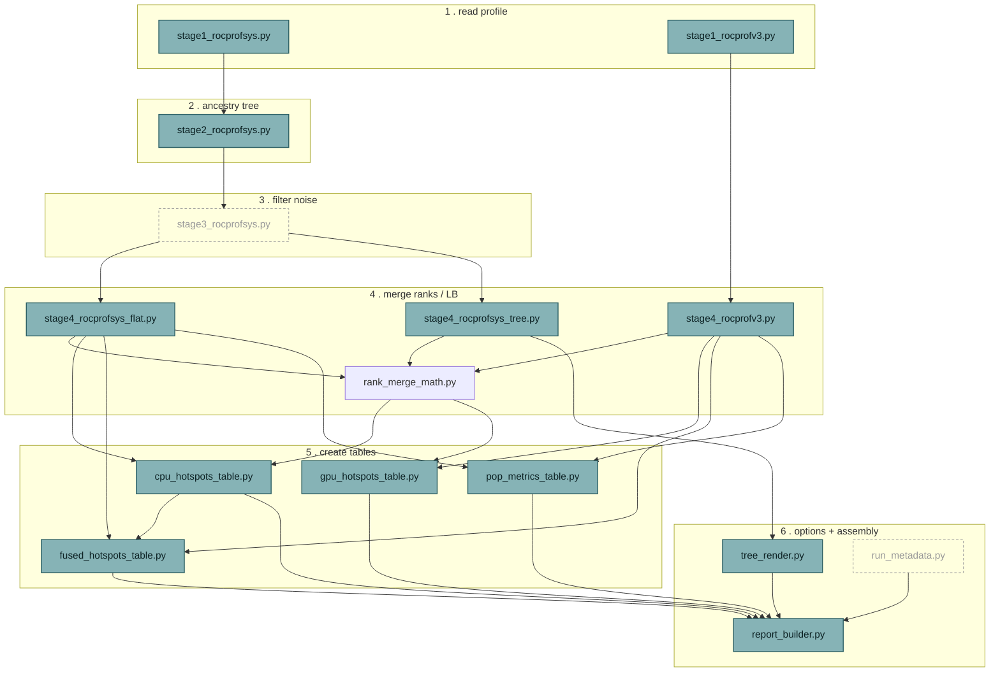

Solid = settled. Dashed = decided to exist and where it sits, not yet designed inside
(`stage3_rocprofsys.py` gets §9; `run_metadata.py` is a reasonable default name, not yet put to a
decision the way the others were). `fused_hotspots_table.py` reuses `cpu_hotspots_table.py`'s
`select()` for ranking, on top of its own cross-source correction math. Every one of the 8 tool
files becomes a pure stage-6 consumer of stage 5's four table modules plus stage 6's three shared
pieces.

### Stage 4 splits three ways, not two

The original "one file per stage+source" plan missed that *matching* (which per-rank values
belong together) and *merge math* (turning a matched set of values into one number or a stats
bundle) were fused inside the same functions. They split cleanly.

| file | holds | why |
|---|---|---|
| `stage4_rocprofsys_flat.py` | `scan_ranks()`, `aggregate()`, `aggregate_per_rank()` | by-label matching (hotspots tools) |
| `stage4_rocprofsys_tree.py` | `merge_rank_trees()`, `flatten_tree()` + the kernel-attach tail (`attach_kernel_summaries()` and helpers, reclassified from a would-be stage-5 file since it finishes the tree rather than building a table) | by-tree-position matching (calltree tools) |
| `stage4_rocprofv3.py` | GPU's own `aggregate()` / `aggregate_per_rank()` | GPU's flat matching — different input shape, not a fork of the CPU one |
| `rank_merge_math.py` | `stats_across_ranks()` → avg/std_dev/min/max | source-agnostic — the shared primitive inside `compute_load_imbalance()` (CPU and GPU, closing §7's exact-duplicate) and `aggregate_node_stats()` |

### Stage 5: four files, corrected from an earlier "two, not four"

Revised from an earlier draft of this section: the original test was "does 2+ files need this,"
concluding the fused table and the pop-metrics table didn't deserve their own stage-5 module since
each has one consumer. That was the wrong test — the real question is what *kind* of work it is.
Computing/selecting what a table shows is stage 5 regardless of how many tools call it; only
"which options, which sections, assemble and write" is stage 6. `build_combined_view()` and the
POP-metrics computations are unambiguously stage-5 work that had been left sitting inside their
tool's stage-6 file.

| file | holds | consumers |
|---|---|---|
| `cpu_hotspots_table.py` | `select()` / `render()` for the self/inclusive/count/%self-shaped table, plus its load-imbalance variant | extract_CPU_hotspots.py (×2 titles), extract_hotspots.py (×3), select_hotspot_functions.py, fused_hotspots_table.py |
| `gpu_hotspots_table.py` | the kernel-shaped (total/calls/avg-µs) equivalent, plus its load-imbalance variant | extract_GPU_hotspots.py, extract_hotspots.py, select_hotspot_kernels.py |
| `fused_hotspots_table.py` *(new)* | `build_combined_view()` — the GPU-sync-wait double-count correction, pulled out of extract_hotspots.py — plus its own domain-tagged render (adds the "dom" column) | extract_hotspots.py only today |
| `pop_metrics_table.py` *(new)* | `compute_run_metrics()`, `compute_scaling_metrics()`, `compute_gpu_efficiency()`, `gpu_sync_wait_per_rank()`, and the LB/CommE/PE row formatting — pulled out of extract_pop_metrics.py | extract_pop_metrics.py only today |

### Stage 6: redefined as options + composition, applies uniformly to all 8 tools

With the correction above, every tool file ends up the same shape: no table-producing logic of
its own left, only the options it exposes and which stage-5 sections it decides to build.

| piece | role | note |
|---|---|---|
| `report_builder.write_report_file(dest_path, parts)` | the join + write-to-file + return, exactly as every tool already does it | byte-for-byte identical across all 6+ `write_report()`s today — zero-decision extraction, found outside the original §7 audit scope |
| `report_builder.section(title, body)` | optional convenience for the common "title + table/tree text + blank line" shape | not forced on everything — caveats footers and inline notes stay as plain strings |
| `tree_render.py` | `render_forest()`, `format_aligned_rows()`, `build_children_map()`, `resolve_run_dirs()` — calltree_common.py, narrowed | kept as a deliberate exception to "stage 6 lives in tool files" — collapsing it would recreate §6 finding 7's ~70%-duplicate problem |
| each tool's own `write_report()` | argparse-driven preamble + a sequence of section calls into stage 5's table modules | extract_CPU_hotspots.py builds 2 sections from 1 module; extract_hotspots.py builds 6 from 4; extract_pop_metrics.py builds 1 from pop_metrics_table.py — same shape, different guest list |

## 9. Stage 3 engine design

*Tag-then-act, config-driven, one shared walk.* §7 found stage 3's duplication; this replaces it.
The core move: separate **classification** (is this row noise, and which kind — a shared,
one-pass engine) from **treatment** (what to do about it — a small declarative table each tool
supplies). Every tier that exists today as a hand-written, tool-specific function becomes one
shared tag, checked once, acted on differently per tool.


One shared children-map, built once, feeds all three tagging passes — replacing today's ~6
independent full re-scans (each rebuilding its own `children_by_parent_id`) across
`extract_CPU_hotspots.py` and `extract_calltree.py` combined. Nothing is removed from the tree
until every row is fully tagged.

### 5 scopes — what a pattern is allowed to look at

Four came from tracing the existing predicates; the fifth came from elaborating on a hypothesis
about calltree's missing MPI-thread handling — it generalizes a mechanism that already exists for
GPU threads, just hardcoded to one tag.

| scope | question it answers | pass needed | existing example |
|---|---|---|---|
| **self** | does this row's own label match? | none — checked inline | most tiers (GPU-API, compiler-runtime, direct wrapper match) |
| **ancestor** | does this row or any ancestor match? | top-down, free — `ancestor_tags = own_tags \| parent.ancestor_tags`, riding the existing pre-order | `classify_gpu()`, `is_runtime_thread_noise()` |
| **descendant** | does this row or anything under it match? | bottom-up, memoized | structural wrapper contamination |
| **sibling-group** | does a sibling's subtree match, with at least one OTHER sibling staying clean? | rides the bottom-up pass's results, grouped by parent | the gotcha-contaminated-branch case |
| **first-real-descendant** *(new)* | for an untethered root (parent = None) only: walk down through wrapper hops to the first real content, inherit *its* tag(s) | a third, targeted pass — just the untethered roots | generalized from `propagate_gpu_to_untethered_thread_roots()`, hardcoded to the `gpu` tag only today |

### 5 actions — what happens to a tagged row

| action | effect | existing example |
|---|---|---|
| **prune** | whole subtree hidden from render/aggregation | GPU-API and compiler-runtime tiers in calltree |
| **collapse** | node stays visible, its children are hidden | MPI territory in calltree |
| **splice** *(+fold)* | node removed, children reparented up one level; optionally transfers the removed node's own self-time into its new parent instead of discarding it (new — nothing does this today) | `splice_out_wrapper_nodes()` (without the fold) |
| **structural_drop** | sibling-comparative whole-subtree removal | `mark_wrapper_contaminated_branches()` / `prune_wrapper_contaminated_branches()` |
| **bucket** | tag-only, no tree surgery — a later stage routes the row's numbers into a different table | CPU hotspots' GPU-API rows → table 2 instead of dropped |

Each tool supplies its own `{tag: action}` map — e.g. calltree's `wrapper_noise → splice` vs. CPU
hotspots' `wrapper_noise → drop` (no tree to splice into, since it's already flattened by this
point) — same tag, same classification pass, different treatment per tool's own data shape.

### Patterns as data, not Python constants

`GPU_API_PREFIXES`, `ROCPROFSYS_WRAPPER_SUBSTRINGS`, `MPI_PREFIXES`, `COMPILER_RUNTIME_SUBSTRINGS`
move out of Python entirely, into a shipped `postprocess/default_noise_patterns.json` (tag name →
substring list). Scope and action stay code-defined — only the patterns themselves are data. An
optional user file, same schema, diffs against the shipped defaults:

```json
{
  "add": {
    "wrapper_noise": ["my_site_gotcha_variant"],
    "other": ["some_vendor_specific_noise_"]
  },
  "remove": {
    "wrapper_noise": ["gotcha"]
  },
  "disable": ["mpi_territory"]
}
```

- **Loading**: `--extra-noise-config PATH` flag, falling back to `FRIENDLY_ROCPROF_NOISE_CONFIG`
  env var — explicit only, never silently auto-discovered from a conventional filename.
- **`other`**: reserved tag, always available for `add` — self-scope substring match only,
  defaults to `splice` (with fold) everywhere unless a tool overrides it.
- **Precedence**: a tag listed in `disable` is skipped entirely by the engine — any `add`/`remove`
  for that same tag is simply ignored, not an error.

### Findings this design closes structurally, not by patching

- **`extract_pop_metrics.py`'s narrower MPI check** — its inline
  `label.lower().startswith(MPI_PREFIXES)` misses the `_f08_`/`_f08ts_` Fortran-shim suffix
  `is_mpi_territory()` also checks. Once pop_metrics reads the shared `mpi_territory` tag instead
  of re-deriving its own check, there's no second classification left to drift out of sync.
- **calltree's missing MPI-thread-noise handling for untethered roots** — closes as a side effect
  of generalizing the fifth scope above: `propagate_gpu_to_untethered_thread_roots()`'s "inherit
  from the first real descendant" mechanism gets parameterized by tag instead of hardcoded to
  `gpu`, so an MPI-spawned untethered thread gets caught by the same generic pass a GPU-spawned
  one already is. No bespoke MPI-thread code needed. Still unconfirmed against real data whether
  this shape actually occurs — worth checking a real capture for an untethered `start_thread`
  root before treating it as fixed.
  > **Update (plan 2.6):** checked, and it's unsafe as designed, not just unconfirmed — see
  > [docs/plans/2.6-wire-stage3-into-tools.md](2.6-wire-stage3-into-tools.md)'s implementation
  > notes. The mechanism can't tell a genuine program root (`parent=None`, real content) apart from
  > an untethered thread-spawn artifact (also `parent=None`, but noise) — both look identical to the
  > engine. A real `main` whose first traced child is `MPI_Init` (true of nearly every MPI program)
  > would inherit `mpi_territory` and be misclassified. `gpu_api`'s identical theoretical gap never
  > manifests in practice (a real `main`'s first child is essentially never GPU-API-labeled);
  > `MPI_Init`-as-first-child is near-universal, so plan 2.6 does not enable this for `mpi_territory`.
- **Compiler-runtime noise having no CPU-hotspots equivalent** (§7) — no longer a structural gap
  either way: the engine tags `compiler_runtime_noise` for every tool uniformly, so CPU hotspots
  picking it up is now a one-line addition to its own action map.

## 10. Report style guide

> **Divergence (plan 2.10):** applying this section landed across two plans, not one, and grew
> beyond the 7 rules below. Rule 6 (120-column hard-wrap + `iter_table_rows()`) was split into its
> own follow-up, **plan 2.11**, since it independently touches two renderers and both
> `select_hotspot_*.py` re-parsers — large enough to review alone. The other 6 rules landed
> together in **plan 2.10**, which also folded in two related fixes discovered while applying
> them: table-owned prose (the `%total`/ranking/load-imbalance/aggregation legends) that had been
> hand-duplicated per tool moved into the owning stage5 table module instead, generated from the
> same parameters (e.g. `select_entries()`'s `threshold_unit`) that already decide the table's
> shape; and every tool's header collapsed into one shared `stage6_report_builder.standard_header()`
> function (closing the metadata-presentation item plan 2.8 deferred here), rather than each tool
> hand-building its own. `report_builder.py` itself is `stage6_report_builder.py` post-split (see
> plan 2.7's own divergence note above) — this section's rules apply to it and to
> `stage5_table_render.py`/`stage5_tree_render.py` as appropriate, not to one merged module. See
> [docs/plans/2.10-report-style-guide-part1.md](2.10-report-style-guide-part1.md) for the full
> as-built design; the rules and schematic below are left as originally written for the historical
> record. Rule 6 itself landed in **plan 2.11**: the wrap/cap logic for each renderer's own layout
> became its own standalone, reusable function (`stage5_table_render.wrap_trailing_label()`,
> `stage5_tree_render.wrap_leading_labels()`) rather than inlined into `render_table()`/
> `format_aligned_rows()`, so a future table or tree renderer sharing either layout can call it
> directly — see [docs/plans/2.11-report-hard-wrap.md](2.11-report-hard-wrap.md).

*One text-formatting system, enforced by `report_builder.py`, not decided six times.* Every rule
below exists because tracing the six current report-writers turned up a real, concrete
inconsistency — not a stylistic preference applied from outside.

Schematic example (not byte-exact — illustrates structure, not exact column widths; real output
uses the full 120-column target from rule 6):

```
rocprof-sys hotspots report (CPU-side only)
generated: 2026-08-13T09:30:00
source directory: /home/user/hpc/results/profile_hotspots_C_cray
command: /usr/bin/python3 /home/user/Friendly_Rocprof/postprocess/extract_CPU_hotspots.py \
         /home/user/hpc/results/profile_hotspots_C_cray --top 10

=== 1. CPU compute hotspots -- showing top 10 of 42 entries ===

    #     self(s)   calls  function
    1    3.210000       1  run_simulation
    2    1.050000       3  compute_stencil_update_for_boundary
                            _condition_handling
  - self time only; a function that just calls other functions
    falls out of this ranking on its own

=== 2. GPU API / launch overhead -- showing top 10 of 8 entries ===
  ...

For details on sampling behavior, noise filtering, and kernel-placement
caveats, see extract_CPU_hotspots.py --help.
```

### The 7 rules, each from a traced inconsistency

| # | rule | replaces |
|---|---|---|
| 1 | **lowercase headers everywhere** — except pop_metrics' POP-methodology acronyms (`LB`, `CommE`, `PE`, `GPU-Util`, ...), kept exactly as defined in `docs/pop_metrics_reference.md` | a 3-way split today: lowercase (5 tables), UPPERCASE (calltree), mixed abbreviations (pop_metrics) |
| 2 | **`=== N. Title ===` for 2+ sections**, bare sentence for exactly one — computed dynamically per report, not hardcoded | extract_hotspots.py does this correctly today; CPU/GPU hotspots use bare sentences despite having 2-3 sections; pop_metrics brackets a single section that shouldn't be bracketed |
| 3 | **title, blank line, table, blank line** — always, nothing wedged in between | CPU hotspots' GPU-API section puts a caveat sentence directly between the title and the table today |
| 4 | **table-specific notes become a `  - ` bulleted list** directly under their table, inside the same blank-line boundary | pop_metrics already does this (3 separate blocks) — the one tool to generalize from; everywhere else is unbulleted prose |
| 5 | **general/methodology notes redirect** to one closing `--help` line instead of being repeated per report — *conditional on `HELP_BLURB` already containing that content* | calltree's 7-bullet Caveats footer, much of it already duplicated in its own `HELP_BLURB` |
| 6 | **long names hard-wrap at a shared 120-column target** — available label width = 120 minus that row's own prefix width; continuation lines indent to align exactly under where the label started, never flush-left | calltree's shared-width computation lets one long label drag every row's alignment; numbers-first tables leave long labels to uncontrolled terminal soft-wrap, the same problem differently disguised |
| 7 | **a `command:` header line** — `sys.executable` + `os.path.abspath(sys.argv[0])`, plus every argument in a small per-tool `PATH_ARGS` list resolved to absolute via the parsed argparse Namespace (not raw-argv pattern-matching) | no tool records its own invocation today — a report can't be reproduced later without remembering exactly how it was run |

### Addendum to rule 6 — the format needs a reader, not just a writer

`select_hotspot_functions.py` and `select_hotspot_kernels.py`'s `labels_from_report()` re-parse a
written report's text as a data source, one physical line per row. Rule 6's hard-wrap breaks that
assumption — a long label now spans 2+ physical lines, and the naive line-by-line parser would
either drop the continuation silently or misread it as a malformed row. Since `report_builder.py`
already owns *writing* the wrap, it owns *reading* it back too, rather than letting two
independently-hand-rolled parsers drift out of sync the next time the wrap rule changes:

```python
def iter_table_rows(lines):
    """Yields each logical row's tokens, with a hard-wrapped label already
    rejoined across continuation lines -- callers never see the physical
    line breaks rule 6 introduces."""
    current = None
    for line in lines:
        if not line.strip():
            break
        first = line.split(maxsplit=1)[0] if line.split() else ""
        if first.lstrip("-").isdigit():
            if current is not None:
                yield current
            current = line.split(maxsplit=NUM_COLUMNS - 1)
        elif current is not None:
            current[-1] += line.strip()
    if current is not None:
        yield current
```

**Detection rule**: a line is a continuation, not a new row, iff its first whitespace-split token
doesn't parse as a plain integer — every real row's `#` column always is one, a continuation line
never is. **Reconstruction**: continuation text appends directly to the previous label, no
separator — hard-wrap is a lossless character-level cut, so undoing it is plain concatenation.
Generalizes to any number of continuation lines, not just two. `select_hotspot_kernels.py`'s
`calls >= 2` filter is decided once, from a row's first line only — continuation lines inherit
that row's include/exclude decision rather than being evaluated independently. Both consumers keep
their exact existing per-row logic unchanged; they just iterate `report_builder.iter_table_rows()`
instead of raw physical lines.

Known, accepted limitation: a wrap point that happens to land mid-identifier on a digit run could
leave a continuation line whose own first token is pure digits, misread as a new row. Real
C/C++/Fortran identifiers can't *start* with a digit, so this only bites on a digit run appearing
exactly at a cut point — vanishingly rare, and cheap to close later by having `report_builder.py`
export its known prefix width instead of guessing, if it ever actually happens.

### Precondition for rule 5 — audited, not assumed

A redirect is only lossless if the destination already says it. Checked line-by-line rather than
assumed:

- **calltree.py** — 4 of its 6 Caveats bullets already overlap `HELP_BLURB` closely enough to
  redirect safely today. 2 don't yet exist there and need to be added first: which tree-surgery
  action applies to which noise tier (wrapper → spliced, MPI → collapsed, GPU/compiler-runtime →
  pruned), and the compiler-runtime tier being built from Cray's Fortran runtime specifically, not
  verified for other compilers.
- **extract_pop_metrics.py** — its "Not computed" block is already in `HELP_BLURB` almost
  verbatim, safe to redirect as-is. Its "Caveats" block (the MPI-prefix list, the CPU↔GPU per-rank
  pairing assumption) isn't in `HELP_BLURB` at all yet — that content needs to be added there, not
  just deleted from the report, or it's genuinely lost information rather than a redirect. Its
  "Metric explanation" block stays inline regardless — it's a short, per-shown-column legend, not
  general background, so rule 5 doesn't apply to it.

## 11. Test suite audit

*`postprocess/tests/` — 9 files, ~180 test methods, mapped against §8/§9.* Same method as §7,
applied to the tests before touching any implementation. Most of the 2,942 lines relocate cleanly
with their code; the largest single bucket doesn't relocate at all — it gets rewritten around
§9's tag-then-act vocabulary, because that's exactly the code it tests.

### relocate — moves with its code, no rework

| test class(es) | current file | target |
|---|---|---|
| `CleanLabelTests`, `ParseTableFileTests` | test_extract_CPU_hotspots.py | stage1_rocprofsys.py |
| `ParseKernelStatsCsvTests` | test_extract_GPU_hotspots.py | stage1_rocprofv3.py |
| `AttachAncestryTests` (the mechanics part) | test_extract_CPU_hotspots.py | stage2_rocprofsys.py |
| `RenderingTests`, `FormatAlignedRowsTests`, one `ResolveRunDirsTests` copy | test_calltree_common.py | tree_render.py |
| `MetadataGuessingTests` / `ConfigJsonGuessingTests` | CPU / GPU hotspots test files | run_metadata.py |
| `EscapeForInstrumentRegexTests`, most `MainCLITests` | select_hotspot_*.py test files | unchanged in place |

### duplicate — mirrors §7's code duplication on the test side

| test class | copies found | note |
|---|---|---|
| `ResolveRunDirsTests` | test_calltree_common.py, test_extract_calltree_traced.py, test_extract_pop_metrics.py, test_extract_calltree.py — **4 copies** | consolidates to one, against tree_render.py, once §7 finding 1's code duplication is fixed |
| `ComputeLoadImbalanceTests` | test_extract_CPU_hotspots.py:637 vs test_extract_GPU_hotspots.py:162 | confirms §7 finding 8's exact-duplicate claim from the test side too |

### split — the function under test is being split, so the test should be too

`AggregateNodeStatsTests` (calltree_common), both `ComputeLoadImbalanceTests` copies → a
`rank_merge_math.py` test for the shared avg/std/min/max primitive itself, plus a thin per-table
test confirming each table module calls it correctly (§8's stage-4 three-way split).

### rework — the largest bucket: tests a function §9 removes

Not a relocation — these test bespoke, tool-specific noise predicates that stop existing once
§9's engine ships. They get rewritten around tagging under a scope, and separately, a tool's
action map applying the right tree surgery to a tagged row.

| file | test classes needing rework |
|---|---|
| test_extract_CPU_hotspots.py | `IsGpuEntryTests`, `IsRocprofsysWrapperNoiseTests`, `ClassifyGpuTests`, `IsRuntimeThreadNoiseTests`, `IsMpiTerritoryTests`, `MarkWrapperContaminatedBranchesTests`, `WrapperContaminatedBranchFixtureTests`, `GpuSpawnedThreadFixtureTests` — 8 classes |
| test_extract_calltree.py | `GpuNoiseTierTests`, `RocprofsysWrapperSpliceTests`, `WrapperContaminatedBranchTests`, `UntetheredThreadRootGpuPropagationTests`, `MpiCollapseTierTests`, `CompilerRuntimeTierTests`, `ShowAllInternalsTests` — 7 classes |
| test_extract_CPU_hotspots.py (scan_ranks' own tests) | `test_rocprofsys_wrapper_noise_excluded_from_both_buckets`, `test_mpi_spawned_thread_noise_excluded_from_both_buckets` — move to stage 3's test file; `scan_ranks()`'s own remaining surface shrinks to "merge already-tagged rows by label" |

### reformat — assertions change from §10, logic doesn't

Every end-to-end `WriteReportTests`-style class, in all 9 files, asserts against exact report
text. §10 changes headers, section markers, and adds the `command:` line — none of these need new
logic coverage, but every literal string assertion needs a pass, worth doing deliberately in one
sweep rather than discovered piecemeal as tests start failing.

### gap — confirmed missing coverage, not just missing code

`MpiPrefixReconciliationTests` (test_extract_pop_metrics.py:112) has exactly one test, covering
`mpidi_` and case-insensitivity — nothing exercises the `_f08_`/`_f08ts_` Fortran-shim suffix.
That's the same gap behind §9's finding #1 — there was never a test that would have caught it.
Add the missing case once pop_metrics migrates to the shared `mpi_territory` tag.

### resolved — the one real design conflict this audit found

`LabelsFromReportTests` in both select_hotspot_*.py test files exercise `labels_from_report()`'s
line-by-line parsing — which §10 rule 6's hard-wrap would have silently broken. Resolved via
`report_builder.iter_table_rows()`, see §10's addendum. New test needed once implemented: a
fixture with a wrapped long name, verifying both consumers reconstruct it correctly across the
continuation line.

### Fixtures need no equivalent reorganization

The ~30 fixture directories under `tests/fixtures/` are already named by scenario
(`mpi_spawned_thread_noise/`, `wrapper_contaminated_branch/`), not by which test file consumes
them — they're already decoupled from the file structure that's about to change. No renaming or
moving needed as part of this pass.

## 12. Implementation roadmap

*Plan of the plans — sequenced by dependency, not by section number.* One invariant carries every
plan through step 9: report output stays byte-identical to today, except two named, tracked
exceptions (§9's findings #1 and #2). Only the final formatting plan is allowed to change what a
report looks like. That gives a cheap, mechanical check at every step — any other diff in
real-data output is a bug, not a feature.

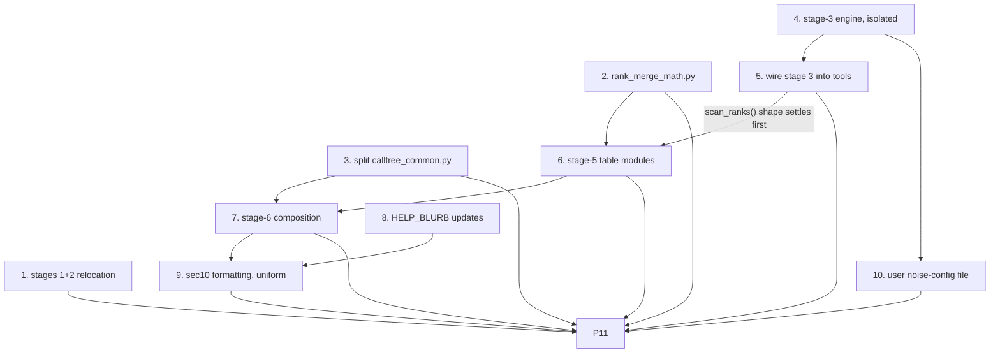

Nodes with no incoming arrow have no dependency on anything else in this plan — P1, P2, P3, and P4
can run in any order, or in parallel, before P5 needs P4 to exist.

| # | plan | scope | depends on | verification |
|---|---|---|---|---|
| 1 | **Stages 1+2 relocation** | create stage1_rocprofsys.py, stage1_rocprofv3.py, stage2_rocprofsys.py; move parse/ancestry functions; update callers | none | byte-identical real-data output — pure move |
| 2 | **rank_merge_math.py extraction** | pull the avg/std/min/max core out of aggregate_node_stats() and both compute_load_imbalance() copies | none | byte-identical output |
| 3 | **Split calltree_common.py** | stage4_rocprofsys_tree.py (merge/flatten/kernel-attach) + tree_render.py (rendering only) | none | byte-identical output |
| 4 | **Stage-3 engine, built in isolation** | stage3_rocprofsys.py's 3-pass tagging, 5 scopes, 5 actions, default_noise_patterns.json — not wired into any tool yet | none | unit tests only, against synthetic trees — §11's 15-class rework bucket lands here |
| 5 | **Wire stage 3 into CPU hotspots, calltree, calltree_traced** | delete the old bespoke predicates, replace with engine + each tool's action map; migrate pop_metrics' MPI check onto the shared tag | plan 4 | full real-data re-verification — the only step before 9 where output is *expected* to change, in exactly the 2 tracked ways (findings #1, #2) |
| 6 | **Stage-5 table modules** | cpu_hotspots_table.py, gpu_hotspots_table.py (on rank_merge_math), fused_hotspots_table.py, pop_metrics_table.py — also fixes the nondeterministic tie-order bug in `compute_load_imbalance()`'s sort (found during plan 2.3's verification) as part of relocating that function here, rather than as a separate patch | plan 2 (primitive); plan 5 (gpu_sync_wait_per_rank calls scan_ranks() directly — its post-rewrite shape needs to be settled first) | byte-identical output, except the tie-order fix itself (a third tracked exception alongside findings #1/#2) |
| 7 | **Stage-6 composition** | report_builder.py's write_report_file()/section(), run_metadata.py, rewrite all 8 tools' write_report()/main() as thin composers | plan 6 (calls the table modules); plan 3 (needs tree_render.py) | byte-identical output |
| 8 | **HELP_BLURB precondition updates** | add calltree's 2 missing bullets; add pop_metrics' whole Caveats content | none — could happen any time earlier | manual read-through; gates plan 9's redirect rule |
| 9 | **§10 applied uniformly** | casing, section markers, blank-line/caveat structure, redirect, long-name wrap + report_builder.iter_table_rows(), command-line header | plan 7 (thin tool files to apply it to); plan 8 (redirect precondition) | real-data run + visual review — first step where output text is *intentionally* allowed to change everywhere |
| 10 | **User-facing noise-config file** | --extra-noise-config / FRIENDLY_ROCPROF_NOISE_CONFIG, add/remove/disable | plan 4 (extends the engine's pattern loading) | unit tests + one real-data smoke test with a sample override file |
| 11 | **Final comment-and-docstring audit** | sweep every postprocess/*.py file for any function whose comments weren't naturally rewritten by plans 1–10 (a pure relocation moves code without necessarily rewriting its prose) and bring it in line with CLAUDE.md's Code Comments rules; confirm every module has its required top-of-file scope/functions/philosophy docstring | plans 1–3, 5–7, 9–10 (everything that touches source files) | manual read-through of every file, not a mechanical diff — nothing here should change behavior |

### Granularity is a pace choice, not a technical requirement

Plans 1–3 are all pure, zero-risk relocations with no dependency on each other or on plan 4 — fine
as three small, individually-verifiable diffs (matches this project's established pattern of
small focused plans), or bundled into one if moving faster through the safe part is preferred.
Each plan carries its own §11 test moves in lockstep — not a separate phase, part of the same diff.
