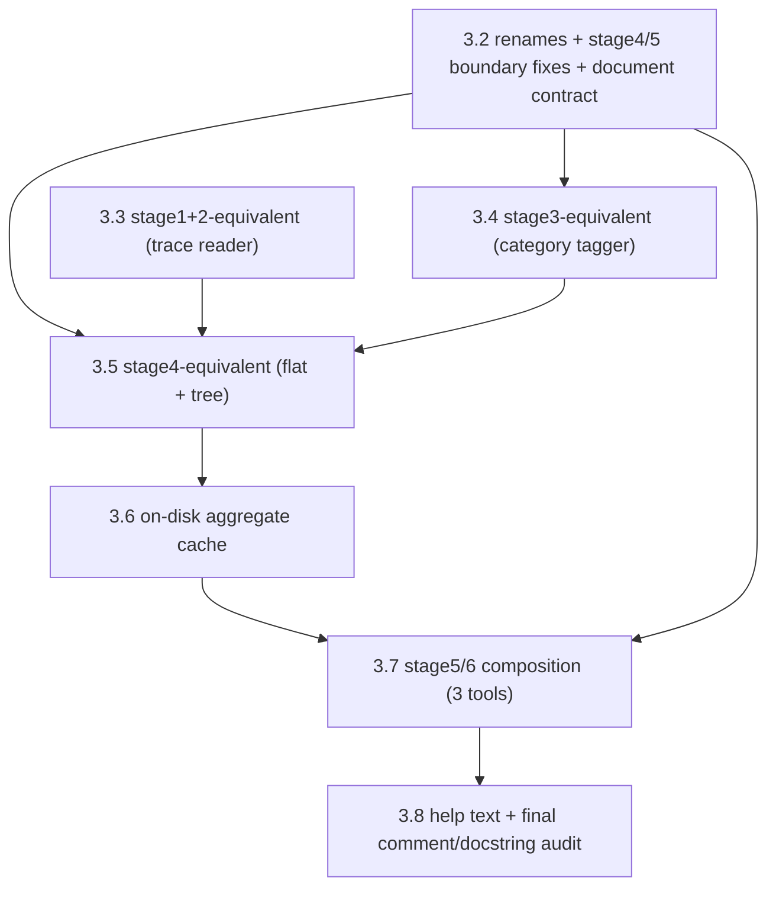

# Plan 3.1 — rocprof-sys trace-CSV post-processing tool family (architecture)

*Numbering note: this is a new major phase (`1.x` = original tool suite, `2.x` = postprocess/
consolidation refactor), so per `CLAUDE.md`'s plan-doc convention it lands as
`docs/plans/3.1-<slug>.md` once approved — the first plan of a `3.x` series, not a continuation of
`2.x`.*

## Context

`postprocess/` currently derives everything from two AMD-native aggregate formats: rocprof-sys's
pipe-delimited timemory text tables and rocprofv3's `kernel_stats.csv`. Both are *already
aggregated* (one row per label per rank, with a `COUNT`/`SUM` already summed across every call at
that position) — which is exactly why stage1's parsers, stage2's ancestry stack-walk, and stage3's
noise-tagging engine look the way they do.

This session, working manually against a real trace
(`Heat_Convection_Solver/instrument_hotspots-trace-output-.../perfetto-trace-{0..3}.proto`), we
converted Perfetto's binary trace format to flat per-rank CSVs using Perfetto's own
`trace_processor` Python package (not part of this codebase — a separate, user-run conversion step,
deferred; see "Explicitly out of scope" below). That CSV is structurally different from both
existing sources: real per-event nanosecond timestamps/durations instead of aggregated stats, one
row per individual call instance instead of one row per label, and a `parent_slice_id`/`depth` pair
that already gives the exact call tree — no stack-walk reconstruction needed. It also carries an
exact, ground-truth `category` per row (`rocm_hip_api`, `rocm_kernel_dispatch`, `mpi`, `ompt`,
`host`, `numa`, `pthread`) and, for GPU rows, real dispatch metadata (`grid_size`,
`workgroup_size`, `group_segment_size`, `corr_id`, ...) pulled from Perfetto's `args` table.

This plan designs a new, parallel family of tools that reads that CSV and produces the same kind of
reports the existing 2.x pipeline produces (CPU/GPU hotspots, full calltree) — but sourced from
real per-event trace data instead of aggregated text tables, and correlating GPU kernels to their
host launch site *exactly* (via `corr_id`) instead of guessing. The goal here is architecture only:
what's genuinely reusable from stage3–6, what needs new code, and where the new pieces live —
matching this project's existing convention (`postprocess/` organized by pipeline stage, tools
under `postprocess/tools/`, mutually importable via `_stage_paths.py`).

## Scope decisions (confirmed)

- **Trace mode**: instrumented/slice-based traces only. Sampling-mode runs (`rocprof-sys-sample`)
  produce timemory text-table output, already fully covered by the existing 2.x pipeline — there is
  no separate "sampled Perfetto trace" case to design for. This family exists specifically for
  traced (`ROCPROFSYS_TRACE=ON`) runs.
- **Row classification**: a new, lightweight category-based self-tagger, not a reuse of the existing
  noise engine's substring/ancestor/sibling-group propagation logic. The trace's `category` field is
  already exact and per-event — the propagation machinery in the existing engine exists specifically
  to compensate for the *ambiguity* of text-table labels (a GPU-API call not otherwise
  distinguishable without checking ancestors); that ambiguity doesn't exist here.
  **Categories are a documented, versioned AMD enum, not something to infer from one trace** —
  confirmed via rocprofiler-systems' own `categories.h` header (ROCm 7.0.1-era doxygen docs):
  `ROCPROFSYS_CATEGORY_{NONE, PYTHON, USER, HOST, ROCM, ROCM_HIP_API, ROCM_HSA_API,
  ROCM_KERNEL_DISPATCH, ROCM_MEMORY_COPY, ROCM_SCRATCH_MEMORY, ROCM_PAGE_MIGRATION,
  ROCM_COUNTER_COLLECTION, ROCM_MARKER_API, ROCM_ROCDECODE_API, ROCM_ROCJPEG_API, ROCM_RCCL_API,
  ROCM_RCCL, SAMPLING, PTHREAD, KOKKOS, MPI, OMPT}`, several `AMD_SMI_*` variants, and various
  system-monitoring categories — a much larger, ROCm-versioned set than the 7 our one sample trace
  happened to exercise (it had no ROCTX markers, no memory copies, no RCCL, no AMD-SMI counters).
  The category→tag map should be built from this documented enum (grouping, e.g., the `*_API`
  categories together as "API overhead" distinct from `KERNEL_DISPATCH`/`MEMORY_COPY` as real
  device-time categories), with an explicit fallback bucket for any category not in the map — both
  because the full enum wasn't exhaustively cross-checked against every current tag's exact
  boundary this session, and because newer ROCm releases can add categories (RCCL support is
  itself fairly new) that an older build of this tool wouldn't know about yet.
- **Caching**: aggregates are cached on disk, in the same input directory the tool was given. Every
  new tool checks for an existing aggregate there first and skips recomputation if found, rather
  than reparsing the raw CSV (which can be 10GB+) on every run.
- **Naming**: the existing `*_rocprofsys*` modules only ever handle rocprof-sys's timemory
  text-table/sampling output — never Perfetto trace data — so their name alone doesn't say that.
  Rather than name the new modules just `*_trace_*` (ambiguous — nothing pins down *whose* trace
  format, and this codebase could plausibly gain a second trace source later), both families get an
  explicit, symmetric qualifier: existing modules become `*_rocprofsys_sample_*`, new ones become
  `*_rocprofsys_trace_*`. See "Renames" below for the full list, including one existing *tool*
  rename this surfaced as a necessary side effect.

### Renames

| current name | renamed to | reason |
|---|---|---|
| `stage1/stage1_rocprofsys.py` | `stage1/stage1_rocprofsys_sample.py` | disambiguate from the new trace-based stage1 module |
| `stage2/stage2_rocprofsys.py` | `stage2/stage2_rocprofsys_sample.py` | ditto |
| `stage3/stage3_rocprofsys.py` | `stage3/stage3_rocprofsys_sample.py` | ditto |
| `stage4/stage4_rocprofsys_flat.py` | `stage4/stage4_rocprofsys_sample_flat.py` | ditto |
| `stage4/stage4_rocprofsys_tree.py` | `stage4/stage4_rocprofsys_sample_tree.py` | ditto — also receives functions moved from `stage5_tree_render.py`, see the stage4/5 boundary fix below |
| `tools/extract_calltree_traced.py` | `tools/extract_wallclock_calltree.py` | **surfaced by, not originally part of, the rename above**: "traced" here has always meant "built from `wall_clock-*.txt` timemory data" (still text-table/sample-sourced, just instrumented rather than statistically sampled) — a different sense of "trace" than the new Perfetto-trace-CSV tools below. Keeping `extract_calltree_traced.py` name-adjacent to a new `extract_trace_calltree.py` would recreate exactly the ambiguity this rename is trying to eliminate, so it goes too. |
| `stage5/stage5_calltree_traced_view.py` | `stage5/stage5_wallclock_calltree_view.py` | companion rename, matches its tool |
| `tests/.../test_stage1_rocprofsys.py`, `test_stage2_rocprofsys.py`, `test_stage3_rocprofsys.py`, `test_stage4_rocprofsys_flat.py`, `test_stage4_rocprofsys_tree.py`, `tests/tools/test_extract_calltree_traced.py` | mirrored `_sample`/`_wallclock` names | keep 1:1 with their renamed module |

New modules (this plan) use the parallel `rocprofsys_trace` qualifier: `stage1_rocprofsys_trace.py`,
`stage3_rocprofsys_trace.py`, `stage4_rocprofsys_trace_flat.py`, `stage4_rocprofsys_trace_tree.py`.
The new CLI tools (`extract_trace_hotspots.py`, `extract_trace_calltree.py`) and the new tool-named
stage5 companion (`stage5_trace_calltree_view.py`) keep plain "trace" — these follow the *tool*
naming convention (named after role, not source format, matching e.g. `stage5_calltree_view.py`
today), and the `extract_wallclock_calltree.py` rename above already cleared the ambiguity they'd
otherwise have collided with.

This is a real, if mechanical, rename of existing working code — every import site across
`stage5_tree_render.py`, `stage5_calltree_view.py`, `stage5_wallclock_calltree_view.py` (renamed),
`stage5_fused_hotspots_table.py`, and each affected `postprocess/tools/*.py` needs updating, plus
`postprocess/README.md`'s own references. Same discipline as any of 2.x's pure-relocation steps:
byte-identical behavior for the existing tools, verified by re-running the existing test suite
after the rename, not a rewrite.

## Is "reuse stage5/stage6" (point 6) really true? — verified, not assumed

Directly read (not just summarized by agents) `stage5_table_render.py`, `stage4_rocprofsys_tree.py`
(pre-rename name, used below since that's what's on disk today), `stage3_rocprofsys.py`, and
`stage6_cli_common.py` to check this. Verdict: **yes, substantially**, with two concrete
refinements and one real simplification:

| module | verdict | why |
|---|---|---|
| `stage5_table_render.py` (`select_entries`, `render_table`, `wrap_trailing_label`, `iter_table_rows`, `pct_total_note`, `ranking_note`) | **reusable as-is** | Confirmed by direct read: `select_entries` only ever indexes `e[rank_field]`/`e[tie_break_field]`/`e[threshold_field]` — any flat dict of numbers works (`stage5_table_render.py:48,58`). `render_table`'s `columns` spec is 100% caller-supplied lambdas, no hardcoded key names anywhere. |
| `stage5_tree_render.py` rendering core (`render_forest`/`render_node`/`get_children`/`build_children_map`/`format_aligned_rows`/`wrap_leading_labels`) | **reusable as-is** | Only needs `node["label"]`, `node["parent"]`/`row["parent"]`, optional `static_children`, and whatever `node_values(node)` returns. Its loader/GPU-pairing functions (`load_rank_trees`, `pair_gpu_per_rank`, etc.) are NOT reusable as-is — hardwired to rocprof-sys/rocprofv3 file discovery — see the stage4/5 boundary fix below for where they actually belong. |
| `stage4_rocprofsys_tree.py` (→ `stage4_rocprofsys_sample_tree.py`): `merge_rank_trees`, `flatten_tree`, `caller_chains_for_label`, `aggregate_node_stats` | **reusable as-is, with one new glue function** (see below) | Verified directly (`stage4_rocprofsys_tree.py:74-135`): `merge_rank_trees()` matches children by `(id(parent), label)` — this is *exactly* the "collapse repeated same-position calls" pass trace-CSV data needs, since 500 identical-label sibling rows under one shared parent object collapse into one `merged_node` via the same mechanism it already uses to merge across ranks. See "New glue function needed" below for the one real wrinkle this uncovers. |
| same file: `make_node_values` | **reusable as-is** | Cross-rank avg/std/min/max is exactly the right shape once each rank has been reduced to one number per tree position (see two-pass merge below) — this isn't "aggregated stats data that doesn't apply to trace data," it's the same load-imbalance-across-MPI-ranks computation the existing calltree tools already do, just fed real durations instead of timemory's `SUM`. |
| same file: `attach_kernel_summaries`, `kernel_owner_label`, `find_kernel_anchors`, `_attach_kernel_group` | **not reusable, and not needed** | This whole apparatus exists to *guess* which CPU frame launched a kernel (name-demangling, proportional weight-splitting across ambiguous launch sites) because rocprofv3's `kernel_stats.csv` carries no link back to the host call. Trace-CSV's `rocm_kernel_dispatch` rows carry `corr_id`, giving an **exact** correlation to the host-side `rocm_hip_api` launch row — a direct join replaces the whole heuristic. A real simplification, not a gap. |
| `stage4_rank_merge_math.stats_across_ranks()` | **reusable as-is** | Pure numeric primitive over a list of numbers; module docstring itself disclaims caring where they came from. |
| `stage6_report_builder.py`, `stage6_run_metadata.py` | **reusable as-is** | Pure string/dict assembly (`render_report`, `standard_header`, `write_report_file`, `load_json_file`/`find_first_key`/`guess_*`) — zero format coupling anywhere. |
| `stage6_cli_common.py`: `require_directory(ies)`, `resolve_dest`, `add_selection_args`, `add_max_depth_arg` | **reusable as-is** | Confirmed by direct read (`stage6_cli_common.py:32-88`) — pure argparse/path helpers, no rocprof-sys coupling. |
| `stage6_cli_common.py`: `add_noise_tier_args`/`NOISE_TIER_FLAGS` | **not applicable** | Named after the text-table pipeline's specific noise tiers (`gpu_api`, `mpi_internals`, ...); a trace tool needs its own, much shorter, `--show-*` set (see below) since it's filtering by `category`, not by tag. |
| `stage3_rocprofsys.py` (→ `stage3_rocprofsys_sample.py`): `remove_tagged_subtrees`, `splice_by_tag`, `make_collapses_children`, `make_is_pruned` | **reusable as-is** | Confirmed by direct read (`stage3_rocprofsys.py:195-262`): these four only ever read `row["tags"]`/`row["structural_drop_tags"]` — they don't care how those sets were computed. A new category-based tagger just needs to populate the same two keys. |
| same file: `tag_rows()` itself | **not reused** (per scope decision above) | Its substring/ancestor/sibling-group propagation logic is specific to disambiguating text-table labels; superseded by a direct `category` lookup for trace data. |
| `stage6_noise_config.py` / `default_noise_patterns.json` | **not needed** | Exists to load/merge substring patterns for `tag_rows()`; moot once self-tagging is a `category` lookup. |
| `stage1_rocprofsys.py` (→ `stage1_rocprofsys_sample.py`), `stage1_rocprofv3.py` | **not reusable** | Entirely tied to the pipe-delimited/`kernel_stats.csv` formats (header matching, `clean_label()`'s rank/thread-prefix stripping) — none of it applies to an already-clean trace-CSV `name` column. |
| `stage2_rocprofsys.py`'s (→ `stage2_rocprofsys_sample.py`) `attach_ancestry()` | **not needed as a stack-walk** — its *role* becomes ~10 lines | Trace-CSV rows already carry correct `parent_slice_id`/`depth` from Perfetto's own trace processor. What's still needed is trivial: a `slice_id → row` dict built in one pass, used to turn each row's `parent_slice_id` into an actual `row["parent"]` object reference (every downstream consumer — stage3's primitives, `merge_rank_trees()` — expects a reference, not an ID). |

### A stage4/5 boundary gap in plan 2.1 itself, found while designing this

Comparing the flat-hotspots side against the tree side surfaces a real inconsistency plan 2.1 left
in place. On the flat side, staging is clean: `stage4_rocprofsys_flat.scan_ranks()`/`aggregate()`
(file discovery, per-rank parsing/merging) live in stage4; `stage5_fused_hotspots_table.py`'s
`build_combined_view()` (stage5, per 2.1's own explicit reasoning: "computing/selecting what a
table shows is stage 5 regardless of how many tools call it") only ever touches already-aggregated
entries. On the tree side, that boundary was never actually drawn: `stage5_tree_render.py` (verified
by direct read above) holds both the genuinely generic rendering functions (`render_forest`,
`build_children_map`, `format_aligned_rows`, `render_calltree_text`, `REPORT_HEADERS`,
`aggregation_note`, `tree_view_note`) **and** `load_rank_trees()` (file discovery + calling
stage1/stage2/stage3 per rank — the same *kind* of work `scan_ranks()` does on the flat side),
`kernel_totals_with_counts()`, `pair_gpu_per_rank()`, and `attach_and_render_gpu_kernels()` (which
wraps `attach_kernel_summaries()`) — all stage4-shaped orchestration/merge work, sitting in a
stage5-named file. The stage4 tree module already holds the actual merge/attach *computation*
(`merge_rank_trees`, `attach_kernel_summaries`) — it's specifically the file-discovery-and-
orchestration layer on top that drifted into stage5.

**Fix, folded into this plan rather than left for later**: move `load_rank_trees()`,
`kernel_totals_with_counts()`, `pair_gpu_per_rank()`, `attach_and_render_gpu_kernels()` out of
`stage5_tree_render.py` into `stage4_rocprofsys_sample_tree.py` (the renamed tree module — byte-
identical behavior, a pure move, same discipline 2.1's own roadmap used for its own pure-relocation
steps; `extract_calltree.py`'s and `extract_wallclock_calltree.py`'s (renamed) existing
`stage5_calltree_view.py`/`stage5_wallclock_calltree_view.py` companions update their imports
accordingly, no logic change). That leaves `stage5_tree_render.py` holding only genuinely stage5
work — rendering — matching the flat side's already-clean shape. The **new** trace-CSV backend
(loading ranks from the trace-CSV, tagging via the new `stage3_rocprofsys_trace`, merging via
`merge_rank_trees` + the new glue function below, kernel attachment via the new `corr_id` exact
join) is the second of the "2 stage4 files": it belongs in `stage4_rocprofsys_trace_tree.py`
(already planned below), not in a new stage5 module — both the current and the new backend end up
calling the *same* unchanged `stage5_tree_render.py` rendering functions. This makes
`stage5_trace_calltree_view.py` (further below) shrink back to its originally-intended job — the
thin, tool-specific `--show-*`-flag-to-predicate wiring `stage5_calltree_view.py` was always meant
to be, not a place for loading/merging logic.

### New glue function needed (the one real wrinkle in "stage4 is reusable as-is")

`merge_rank_trees()` can genuinely double as the "collapse repeated same-position calls within one
rank" pass (feed it a single-rank list) — verified directly from its algorithm. But its **output**
shape (`{"per_rank": {rank_key: {"count", "self_sum", "sum"}}, ...}`) is not the same as its
**input** shape (flat rows with top-level `count`/`self_sum`/`sum`). So a second `merge_rank_trees()`
call — to merge the now-per-rank-deduped trees *across* ranks — can't take the first call's output
directly. A small (~15-20 line) new function is needed between the two passes: flatten a
single-rank merged tree (already possible via the existing `flatten_tree()`) and pull each node's
single `per_rank[rank_key]` entry back out to top-level `count`/`self_sum`/`sum` keys, ready to feed
the second, cross-rank `merge_rank_trees()` call. This is new code, but it's a small, mechanical
reshape — not a sign the underlying merge algorithm needs rework.

## Proposed new modules (pattern, not exhaustive)

Follows the existing convention of siblings coexisting inside one stage directory (e.g.
`stage4_rocprofsys_sample_flat.py` next to `stage4_rocprofv3.py` next to `stage4_rank_merge_math.py`)
— new trace-specific modules live alongside their (renamed) stage-mates, not in a parallel
structure.

- **`postprocess/stage1/stage1_rocprofsys_trace.py`** *(new)* — streaming reader for the flat
  trace-CSV. Reads with stdlib `csv.DictReader` (matches this project's existing stdlib-only
  convention; `pandas`/the `perfetto` package were this session's own ad hoc prototyping tools for
  the proto→CSV step, which is explicitly deferred, not part of this plan's shipped code). Builds
  the `slice_id → row` lookup and resolves `row["parent"]` in one pass (stage2's collapsed role, see
  table above). Computes `self_sum` as `dur` minus the sum of direct children's `dur` once a row's
  children are known. To bound memory on a 10GB+ trace: keep only the slim fields needed for
  tree-building (`slice_id`, `parent_slice_id`, `label`, `ts`, `dur`, `category`) in the
  long-lived structures; the wide GPU-args columns are only read for `rocm_kernel_dispatch`/
  `rocm_hip_api` rows when building the GPU-detail view specifically.
- **`postprocess/stage3/stage3_rocprofsys_trace.py`** *(new)* — the lightweight tagger. A
  `tag_rows()`-alike that sets `row["self_tags"]`/`row["tags"]` directly from a `{category: tag}`
  map (e.g. `rocm_hip_api → gpu_api`, `rocm_kernel_dispatch → gpu_kernel`, `mpi → mpi_territory`),
  no propagation passes. Imports `remove_tagged_subtrees`, `splice_by_tag`,
  `make_collapses_children`, `make_is_pruned` from the renamed `stage3_rocprofsys_sample.py`
  **unchanged** — those four only touch the tag sets this module populates, never how they were
  computed.
- **`postprocess/stage4/stage4_rocprofsys_trace_flat.py`** *(new)* — by-label accumulation for the
  flat hotspots view, modeled on `stage4_rocprofsys_sample_flat.aggregate()`'s accumulation pattern
  (`stage4_rocprofsys_flat.py:185-206`, pre-rename line numbers) but fed by the trace reader instead
  of file-glob discovery. Also exposes a per-rank `aggregate_per_rank()`-equivalent (one
  `{label: value}` dict per rank, the "per-rank label→value" shape from the general contract below)
  — feeds both the load-imbalance view (`stage5_load_imbalance_table.compute_load_imbalance()`,
  unchanged) and, combined with an equivalent per-rank comm-time/gpu-busy-time gather, the
  per-rank timing-summary shape POP metrics needs (see below).
- **`postprocess/stage4/stage4_rocprofsys_sample_tree.py`** *(renamed + extended)* — receives
  `load_rank_trees()`, `kernel_totals_with_counts()`, `pair_gpu_per_rank()`,
  `attach_and_render_gpu_kernels()` moved here from `stage5_tree_render.py` (see the stage-boundary
  fix above) — a pure relocation, byte-identical behavior for the two existing calltree tools. This
  is "stage4 file #1 (the current backend)."
- **`postprocess/stage4/stage4_rocprofsys_trace_tree.py`** *(new)* — "stage4 file #2 (the new
  backend)": loads trace-CSV ranks (via `stage1_rocprofsys_trace`), tags rows (via
  `stage3_rocprofsys_trace`), the one new glue function described above (per-rank-merged-tree →
  flat rows, ready for cross-rank re-merge via the **unchanged**
  `stage4_rocprofsys_sample_tree.merge_rank_trees()`), and the new `corr_id`-based exact join
  replacing `attach_kernel_summaries()`'s heuristics. `flatten_tree`, `caller_chains_for_label`,
  `aggregate_node_stats`, `make_node_values` are imported unchanged from
  `stage4_rocprofsys_sample_tree.py` too.
- **No new stage5 hotspots column-spec module needed — reuse the existing "view" files directly.**
  Verified by direct read: `stage5_fused_hotspots_table.FUSED_HOTSPOTS_COLUMNS` (the exact
  `# self(s) %total total(s) dom calls name` shape) and `stage5_cpu_hotspots_table
  .CPU_HOTSPOTS_COLUMNS` / `stage5_gpu_hotspots_table.GPU_HOTSPOTS_COLUMNS` are already split
  cleanly from their "backend" — each file is *just* a column-spec constant reading a handful of
  dict keys (`label`, `domain`, `count`, `sum`, `self_sum`, `pct_total` for fused; plus `pct_self`
  for CPU-only; plus `avg_us` for GPU-only), with the actual data assembly living in each file's
  paired `build_combined_view()`/`stage4_*.aggregate()` "backend." The new trace-based backend
  (`stage4_rocprofsys_trace_flat.py`, above) just needs to emit entries in that *same* shape — the
  existing column-spec constants import and work **unchanged**, the same "one view, multiple
  backends" split the codebase already uses elsewhere. This directly answers "can the new tool use
  the same columns as the current tools, with a different backend" — yes, confirmed by reading the
  actual file split, not just plausible in spirit.
- **`postprocess/stage5/stage5_trace_calltree_view.py`** *(new, thin)* — now that the loading/
  merging/attaching backend lives in stage4 (both copies), this file goes back to what
  `stage5_calltree_view.py` was always meant to be per its own docstring ("this tool's own
  `--show-*`-driven prune/collapse predicates ... everything else is generic"): builds
  `is_pruned`/`collapses_children` from this tool's own flags, calls
  `stage4_rocprofsys_trace_tree.py`'s backend function to get `merged_roots`/`flat`, and calls the
  **unchanged** `stage5_tree_render.render_calltree_text()` (plus `aggregation_note()`/
  `tree_view_note()`) to produce the actual tree text — genuinely thin, mirroring
  `stage5_calltree_view.py`'s real shape now that its stage4/5 boundary is fixed. Keeps plain
  "trace" in its name (tool-named, not source-module-named — see Renames above).
- **stage6**: `stage6_report_builder.py`, `stage6_run_metadata.py`,
  `stage6_cli_common.require_directory(ies)/resolve_dest/add_selection_args/add_max_depth_arg` all
  imported **unchanged**. A small new `add_trace_category_args()`-style helper (or a few lines
  added to `stage6_cli_common.py`) covers the trace tools' own, much shorter `--show-*` set.
- **`postprocess/tools/extract_trace_hotspots.py`, `extract_trace_calltree.py`** *(new)* — distinct
  names from the existing `extract_CPU_hotspots.py`/`extract_calltree.py` (different pipeline
  underneath, would be confusing to overload one tool with a `--source` flag branching into two
  unrelated code paths). Follow the existing `-h`/`--help` convention from `CLAUDE.md` (jargon-free
  explanation naming Perfetto + a link, before the flags table).

### CPU-hotspot source: don't hardcode a category name

The sample trace's CPU-side subroutines (`jacobi_sweep`, `jacobi_residual`, ...) showed up tagged
`category='ompt'`, not a generic `host` bucket — but whether `rocprof-sys`'s binary instrumentation
always labels wrapped functions `ompt` regardless of whether they're inside a real OpenMP construct
is **unverified** (no rocprof-sys documentation check done this session on this specific point).
Rather than hardcode `category == 'ompt'` as "the CPU hotspots source," the new hotspots tool should
derive its CPU-side (`domain="CPU"` in `FUSED_HOTSPOTS_COLUMNS`'s terms) pool as **everything not a
`ROCM_*` device/API category** — i.e., reuse the already-proven "not gpu" partition logic, not a
single guessed category name. Safer against `CLAUDE.md`'s own constraint that OpenMP is optional,
never assumed. **Correction, verified by direct read of `stage4_rocprofsys_flat.py:207`**: an
earlier draft of this plan said the CPU pool should exclude `mpi` too — wrong. The existing
`aggregate()` buckets purely on `row["gpu"]`; an MPI-tagged row that isn't itself GPU-classified
lands in `cpu_entries` same as anything else — MPI calls are real CPU self-time and do show up in
the normal hotspots ranking today (POP metrics, in `stage5_pop_metrics_table.py`, separately carves
out communication time as its own metric, but doesn't remove those rows from the hotspots view).
The trace-based CPU pool should match: `category != 'mpi'` should NOT be part of the CPU-domain
filter, only the `ROCM_*` categories should be excluded.
Now that the full `categories.h` enum is in view (see scope decisions above), this also surfaces a
real domain question the existing text-table pipeline never had to answer: `ROCM_MEMORY_COPY`
(device-side data movement) is neither "CPU compute" nor "GPU kernel compute" — it may deserve its
own third domain/table rather than being folded into either bucket by default. Left as an
implementation-time decision, not resolved here.

### Caching design

Per the confirmed decision: each new tool, given an input directory, looks for a cached aggregate
there before parsing the raw CSV. Proposed shape: **one canonical cache per rank — the intra-rank-
merged tree** (JSON, since sets need list-conversion at the serialization boundary — a small,
explicit encode/decode step). Both the calltree tool (renders it as a tree) and the hotspots tool
(flattens it via the existing `flatten_tree()` and re-groups by label) read the *same* cache file,
rather than maintaining two separate aggregate formats for the same underlying data. Naming
convention: `<raw-csv-name>.agg.json` written alongside the raw CSV in that same directory. A cheap
mtime check (cache newer than the raw CSV it was built from) guards against a stale cache surviving
a re-exported CSV with the same name — a lightweight addition on top of the confirmed
existence-check behavior, not a replacement for it.

### A general reflection on the stage4→5 boundary (prompted directly, not just the calltree fix)

The calltree fix above isn't a one-off — reading `stage5_pop_metrics_table.py`'s
`compute_run_metrics()` surfaces the *same* pattern a second time, which is the real signal this is
a general problem, not a one-off oversight. `compute_run_metrics()` mixes two genuinely different
kinds of work in one function: gathering per-rank `total_time`/`comm_time`/`gpu_busy_time` (stage4-
shaped — it calls `stage4_rocprofsys_flat.aggregate_per_rank()`/`scan_ranks()` and
`stage4_rocprofv3.aggregate_per_rank()` *by name*, directly), and the Load Balance/Communication
Efficiency/Parallel Efficiency arithmetic once those three numbers exist per rank (genuinely
stage5-shaped — `compute_run_metrics.py:143-147`'s formulas only ever touch already-computed
per-rank numbers, no format coupling). Exactly like the calltree case: a real computation
(stage5-shaped) is welded to a specific backend call (stage4-shaped) inside one function, which is
precisely what makes "swap the backend, keep the view" fail to just *work* the way it did for the
hotspots/load-imbalance cases.

**Why some cases were trivial and others weren't**: contrasting the three now-examined report
kinds shows the actual variable is *how disciplined the stage4 output shape already was*, not
anything about trace-CSV specifically:
- Flat hotspots (`stage4_rocprofsys_flat.aggregate()` → `{label, count, sum, self_sum, pct_self,
  pct_total}`) and load-imbalance (→ plain `{label: value}` per rank) already had a clean, minimal,
  documented-by-convention output shape, with zero backend-specific logic leaking into
  stage5_table_render/stage5_load_imbalance_table calls. Reuse across backends was automatic.
- Calltree's backend (`load_rank_trees`/`pair_gpu_per_rank`/`attach_and_render_gpu_kernels`) and
  pop-metrics' backend (`compute_run_metrics`) never had that discipline applied — the "get the
  data" step and the "compute what the view needs" step were fused into one function, in the wrong
  stage's file (calltree) or the right file but the wrong function boundary (pop-metrics). Reuse
  across backends requires first *doing* the split that was skipped, not just writing a new backend.

**General principle to carry forward**: stage4's contract with stage5 should be a small, named,
written-down set of canonical shapes — not "whatever a given backend author found convenient."
Concretely, this codebase already has (or, per this plan, will have) exactly these:
  - **flat entry**: `{label, count, sum, self_sum, pct_self, pct_total}` (+ optional `domain`) —
    hotspots-shaped.
  - **tree node**: `{label, parent, children, per_rank, tags, structural_drop_tags,
    static_children}` — calltree-shaped.
  - **per-rank label→value**: `{label: value}` — load-imbalance-shaped (the simplest, already fully
    generic case).
  - **per-rank timing summary** *(new — to be carved out of `compute_run_metrics()` as part of
    reusing pop-metrics for trace data, see below)*: `{rank_key, total_time, comm_time,
    gpu_busy_time}`.

Any new backend for an *existing* report kind should target one of these documented shapes, and
inherits that report's stage5 view for free — that's the actual, generalizable version of "is 6
really true," not something to re-verify by hand for every new source. A genuinely new report kind
that can't be expressed in one of these shapes gets its own new shape and its own stage5 view file —
a legitimate outcome, not a failure of the pattern. Worth writing this down explicitly (a short
section in `postprocess/README.md`, alongside its existing stage-by-stage descriptions) as part of
implementing this plan, rather than leaving it as tribal knowledge one has to re-derive per report
kind, the way this plan just did three times over.

### Load imbalance from trace data (same view, new backend — even more directly than hotspots)

Verified by direct read: `stage5_load_imbalance_table.py` is *already* fully generic end to end —
`load_imbalance_columns()` is a pure column spec (`e['avg']`/`e['std_dev']`/`e['min']`/`e['max']`/
`e['label']`), and `compute_load_imbalance(per_file_totals, ...)` itself (not just its columns) only
ever touches a plain list of `{label: value}` dicts via the already-confirmed-reusable
`stats_across_ranks()` — zero rocprof-sys-specific logic anywhere in the file. So this is an even
more direct case than the hotspots tables: **no new stage5 code at all**, not even a "this file is
already split into columns + backend" observation — the whole file already *is* the generic view.
`stage4_rocprofsys_trace_flat.py`'s planned per-rank aggregator (needed for the hotspots view
anyway) just needs to also expose a per-rank `{label: value}` breakdown — the same
"per-rank label→value" shape from the general contract above — and `compute_load_imbalance()`
consumes it directly, unchanged.

### POP metrics from trace data (assuming multiple profiles) — reusable, but needs the same fix as calltree

Conceptually a strong fit — trace-CSV's `category='mpi'` gives *exact* communication time and
`category='rocm_kernel_dispatch'` gives *exact* GPU busy time, arguably more precise than the
current text-table pipeline's MPI-prefix substring matching. But mechanically, this hits exactly
the boundary problem described above: reusing `stage5_pop_metrics_table.py` requires first pulling
`compute_run_metrics()` apart the same way the calltree fix pulls `stage5_tree_render.py` apart —
a new stage4-shaped function (in each backend: `stage4_rocprofsys_sample_flat.py`'s existing
gathering logic vs. a new trace-based equivalent) producing the per-rank timing-summary shape
above, feeding a slimmed-down `compute_run_metrics()` (or a renamed successor) that does *only* the
LB/CommE/PE/GPU-Util/GPU-Off/GPU-LB arithmetic (`stage5_pop_metrics_table.py:143-168`) — genuinely
stage5-shaped, and already source-agnostic once its three input numbers exist. The scaling-study
layer on top (`compute_scaling_metrics`, `compute_gpu_efficiency`, `pop_metrics_columns`,
`metrics_legend`) is *already* fully generic — it only ever consumes `compute_run_metrics()`'s
output dicts, never reaches into stage4 directly — so "assuming multiple profiles" (2+ trace-backed
runs compared as a scaling study) falls out for free once each run's own per-rank timing summary
exists, exactly like the current multi-directory scaling study does today.

### Can the GPU/MPI-filtered CSVs (this session's ad hoc split) feed the same pipeline up to stage4?

Depends on which report kind, traced to a real structural constraint, not a convention choice:

- **Flat-shaped consumption (hotspots, load-imbalance)** — **yes, directly.** Flat aggregation only
  ever needs `(label, category, dur/self_sum, count)` per row; it never resolves a `parent_slice_id`
  reference. A category-filtered file (`-gpu.csv`, `-mpi.csv`, `-other.csv` from this session's own
  split) is a strict row subset of the same schema and works as a `stage1_rocprofsys_trace.py` input
  on its own, no sibling files needed — same reasoning that makes the wide GPU-arg columns
  (`grid_size`, `workgroup_size`, ...) only ever get read from the `-gpu.csv`-shaped rows in the
  first place.
- **Tree-shaped consumption (calltree)** — **not from one filtered file alone.** A `-gpu.csv` row's
  `parent_slice_id` can point at a non-GPU row (whatever CPU/OMPT frame launched it) that simply
  isn't present in that file — parent resolution breaks, orphaning GPU nodes. However, since this
  session's three-way split was verified to *partition* the full row set exactly (row counts summed
  to the true total for every rank), loading **all three** filtered files for one rank together — as
  if they were one file — reconstructs the identical row set a single unfiltered CSV would give,
  and tree-building works correctly from that combined set. A single filtered file, or a subset of
  the three, does not.
- **Implication for `stage1_rocprofsys_trace.py`'s design**: accept either one full per-rank CSV or
  the complete set of category-partitioned files for that rank (concatenated transparently before
  parent-resolution) as equivalent inputs; but validate/warn rather than silently produce a
  corrupted tree if asked to build a *tree* from a partial set (e.g., only `-gpu.csv` without its
  `-mpi.csv`/`-other.csv` siblings) — flat-only tools have no such restriction and should accept a
  single partial file freely.

### Explicitly out of scope for this plan

- The `.proto` → CSV conversion step itself (point 1 from the original reflections) — deferred, a
  separate future plan. This plan takes the CSV (schema already established and validated this
  session against real data) as its input.
- Sampling-mode (`rocprof-sys-sample`) traces — out of scope per the scope decision above; those
  produce timemory text-table output already covered by the existing 2.x pipeline.

## Verification

Since no `.proto`/trace-CSV tooling exists on this CPU-only dev machine beyond what was hand-built
this session, verification for the eventual implementation plan(s) should follow this project's
established pattern: hand-crafted fixture CSVs (small, matching the documented flat schema) under
`postprocess/tests/fixtures/`, unit tests per new stage module (mirroring
`postprocess/tests/stage{1,3,4,5}/`), and a manual smoke test against the real
`Heat_Convection_Solver` rank CSVs generated this session (small real data, explicitly not
representative of a 10GB+ trace's scale, but real schema/content). The renames above are verified
separately and first: re-run the existing test suite immediately after the mechanical rename/move,
before any new code is written, to confirm byte-identical behavior for the existing tools.

## Next step

This plan is architecture-only, as requested. Follow-on implementation plans (numbered `3.2`, `3.3`,
...) would sequence the actual build — likely starting with the renames + **both** stage4/5
boundary fixes (calltree's `load_rank_trees`/etc. relocation, and pop-metrics' `compute_run_metrics`
split into a stage4 timing-gather + a stage5 LB/CommE/PE-arithmetic function) as their own small,
independently-verifiable first step (pure relocation/refactor, byte-identical output, same
discipline as 2.x's own pure-relocation steps) — worth doing together since they're the same fix
applied twice, not sequenced separately. Then stage1+2-equivalent (parsing + parent-resolution,
byte-verifiable against the raw CSV), then stage3-equivalent (category tagger, isolated unit
tests), then stage4 (the new glue function + `corr_id` join + the per-rank timing-summary gather),
then stage5/6 (thin tool composition — hotspots, load-imbalance, calltree, and pop-metrics all
reusing unchanged stage5 view code once their stage4 inputs match the documented shapes), each
independently verifiable before the next.

## Implementation roadmap

*Plan of the plans — sequenced by dependency, not by section number, matching plan 2.1's own §12
convention.* One invariant carries every plan through the sequence: nothing here changes existing
tools' report output except within 3.2 itself (its renames are import-path-only, not output-visible;
its `compute_run_metrics()` split must remain byte-identical to today's pop-metrics output).
Everything from 3.3 onward is new code with no existing behavior to preserve — the byte-identical
discipline only binds the one step that touches existing files.

Nodes with no incoming arrow (3.2, 3.3) have no dependency on anything else in this sequence and can
run in either order, or in parallel — same "granularity is a pace choice" spirit as plan 2.1's own
roadmap closing note.

| # | plan | scope | depends on | verification |
|---|---|---|---|---|
| 3.2 | **Renames + stage4/5 boundary fixes + document the contract** (merged into one plan) | `stage1_rocprofsys.py`→`_sample`, `stage2_rocprofsys.py`→`_sample`, `stage3_rocprofsys.py`→`_sample`, `stage4_rocprofsys_flat.py`→`_sample_flat`, `stage4_rocprofsys_tree.py`→`_sample_tree`, `extract_calltree_traced.py`→`extract_wallclock_calltree.py`, `stage5_calltree_traced_view.py`→`stage5_wallclock_calltree_view.py` (+ every import site and mirrored test file); move `load_rank_trees()`/`kernel_totals_with_counts()`/`pair_gpu_per_rank()`/`attach_and_render_gpu_kernels()` from `stage5_tree_render.py` into the renamed `stage4_rocprofsys_sample_tree.py`; split `compute_run_metrics()` into a stage4 per-rank timing-gather + a stage5-only LB/CommE/PE/GPU-Util/GPU-Off/GPU-LB arithmetic function; add a `postprocess/README.md` section naming the 4 canonical stage4 output shapes (flat entry, tree node, per-rank label→value, per-rank timing summary) and the rule that a new backend for an existing report kind targets one of them | none | re-run existing test suite unchanged; real-data-shaped fixture reports for both calltree tools and `extract_pop_metrics.py` compared before/after, identical — the rename is zero-logic, the two boundary fixes are byte-identical refactors, the doc addition changes nothing executable |
| 3.3 | **Stage1+2-equivalent (trace reader)** | `stage1_rocprofsys_trace.py`: streaming `csv.DictReader` parse, `slice_id`→row lookup, `parent_slice_id`→object-reference resolution, `self_sum` derivation (dur minus children's dur), slim vs. wide (GPU-args) field handling, single-file-or-partitioned-set input (see "Can the GPU/MPI-filtered CSVs..." above) | none | unit tests against hand-crafted fixture CSVs matching the documented flat schema, including a partitioned-file-set fixture |
| 3.4 | **Stage3-equivalent (category tagger)** | `stage3_rocprofsys_trace.py`: `{category: tag}` self-tagger built from the documented `categories.h` enum, explicit fallback bucket for unmapped categories; imports `remove_tagged_subtrees`/`splice_by_tag`/`make_collapses_children`/`make_is_pruned` from `stage3_rocprofsys_sample.py` unchanged | 3.2 (imports the renamed file) | isolated unit tests against synthetic tagged rows, including an unmapped-category case exercising the fallback |
| 3.5 | **Stage4-equivalent (flat + tree)** | `stage4_rocprofsys_trace_flat.py` (by-label + per-rank breakdown, targeting the flat-entry and per-rank-label→value shapes) and `stage4_rocprofsys_trace_tree.py` (the per-rank-merge reshape glue function, the `corr_id` exact-join kernel attachment, wiring `merge_rank_trees()`/`flatten_tree()`/`aggregate_node_stats()`/`make_node_values()` from `stage4_rocprofsys_sample_tree.py` unchanged) | 3.2, 3.3, 3.4 | unit tests against synthetic multi-rank fixture data (including a repeated-same-position-call case exercising the two-pass merge), output shape checked against 3.2's documented contract field-by-field |
| 3.6 | **On-disk aggregate cache** | `<raw-csv-name>.agg.json` cache: existence check (skip recompute), write-on-miss, mtime staleness check, set/list JSON encode-decode boundary | 3.5 (caches the merged-tree output) | unit tests: cache hit skips the parse entirely (mock/counter-verified), cache miss writes and is re-read correctly, a touched/newer raw CSV invalidates the cache |
| 3.7 | **Stage5/6 composition (new CLI tools)** | `extract_trace_hotspots.py` (hotspots + load-imbalance sections, reusing `FUSED_HOTSPOTS_COLUMNS`/`CPU_HOTSPOTS_COLUMNS`/`GPU_HOTSPOTS_COLUMNS`/`stage5_load_imbalance_table` unchanged), `extract_trace_calltree.py` (`stage5_trace_calltree_view.py` thin composer + `stage5_tree_render` unchanged), `extract_trace_pop_metrics.py` (reusing 3.2's now-generic LB/CommE/PE function + the existing scaling-study layer unchanged) | 3.6, 3.2 | manual smoke test against the real `Heat_Convection_Solver` rank CSVs from this session; report structure (section layout, column headers) compared against the equivalent existing tool's output — NOT byte-identical, since this is a genuinely different, richer data source, with that caveat stated in each tool's own report footer |
| 3.8 | **Help text + final comment/docstring audit** (merged into one plan) | jargon-free `HELP_BLURB` + Perfetto doc link for each of the 3 new tools, per `CLAUDE.md`'s convention; sweep every new/moved/renamed file for `CLAUDE.md`'s comment rules (standing-fact phrasing, no changelog-style history) and confirm every module has its required top-of-file scope/functions/philosophy docstring — mirrors plan 2.1's own step 11 | 3.7 (tools must exist for both halves) | manual read-through of each tool's `-h` output against `CLAUDE.md`'s rules, plus a manual read-through of every touched file for the comment sweep — not a mechanical diff, nothing here should change behavior |

Granularity is a pace choice here too: 3.2 and 3.3 have no mutual dependency and can be done in
either order or in parallel; 3.7's three tools could equally land as three small separate diffs
rather than one, matching this project's established preference for small, individually-verifiable
plans.
